# 🛒 Cloud-Native Production-Ready E-Commerce Architecture

This repository contains the complete codebase and structural deployment guide for **Cloud-Store**, a highly available, secure, and production-ready full-stack application deployed on AWS.

---

## 🗺️ Infrastructure Blueprint
Before starting, review the architectural design to understand the data flow and network isolation layers:

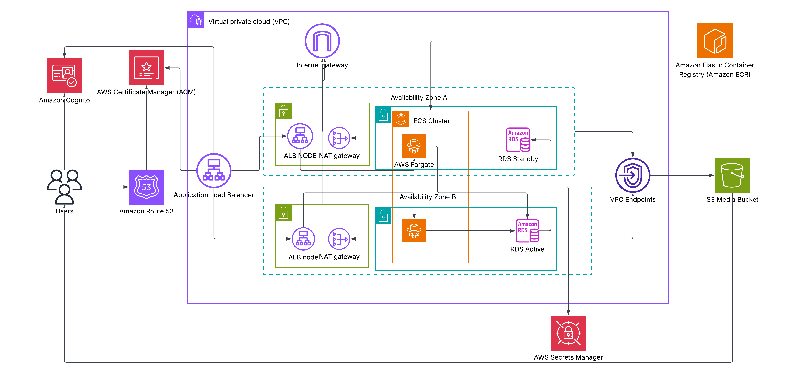

---

## 🛠️ Phase 1: Networking & Core VPC Setup
We will isolate our application components using a Custom VPC spanning two Availability Zones (AZs).

### 1. Create the Custom VPC
1. Open the **AWS VPC Console**.
2. Click **Create VPC** and select **VPC and more**.
3. Configure the following settings:
   * **Name tag project:** `cloud-store-vpc`
   * **IPv4 CIDR block:** `10.0.0.0/16`
   * **Number of Availability Zones (AZs):** `2` *(Select us-east-1a and us-east-1b)*
   * **Number of Public Subnets:** `2` *(CIDRs: 10.0.1.0/24, 10.0.2.0/24)* For ALB internet Facing .
   * **Number of Private Subnets:** `2` 
     * *App and DB Tier:* `2` Private Subnets (CIDRs: `10.0.11.0/24`, `10.0.12.0/24`)
   * **NAT Gateways ($):** Select **1 per AZ** *(To ensure high availability for private app tasks pulling updates) Or regional NAT Gateway*.
   * **VPC Endpoints:** Select **S3 Gateway** *(To optimize internal S3 routing without using NAT traffic)*.
4. Click **Create VPC**.

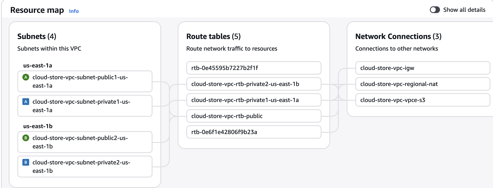

---
## 🛡️ Phase 2: Security Groups & Network Firewalls
To restrict traffic flow according to strict security standards, we will create layered Security Groups (SGs) where each tier only trusts the tier directly preceding it.

### 1. Create the Application Load Balancer Security Group (`sg_alb`)
1. Open the **VPC Console** -> **Security Groups** -> Click **Create security group**.
2. Configure the following:
   * **Security group name:** `sg_alb`
   * **Description:** Allow public web traffic to the ALB.
   * **VPC:** Select `cloud-store-vpc`.
3. **Inbound rules:** Add the following two rules:
   * **Rule 1:** Type: `HTTP` | Port: `80` | Source: `Anywhere-IPv4` (`0.0.0.0/0`)
   * **Rule 2:** Type: `HTTPS` | Port: `443` | Source: `Anywhere-IPv4` (`0.0.0.0/0`)
4. Click **Create security group**.

### 2. Create the ECS Frontend Task Security Group (`sg_ECS_frontend`)
1. Click **Create security group**.
2. Configure the following:
   * **Security group name:** `sg_ECS_frontend`
   * **Description:** Allow traffic exclusively from the ALB on port 80.
   * **VPC:** Select `cloud-store-vpc`.
3. **Inbound rules:**
   * Type: `Custom TCP` | Port: `80` | Source: Custom -> Search and select `sg_alb`.
4. Click **Create security group**.

### 3. Create the ECS Backend Task Security Group (`sg_ECS_backend`)
1. Click **Create security group**.
2. Configure the following:
   * **Security group name:** `sg_ECS_backend`
   * **Description:** Allow API requests exclusively from the ALB on port 8080.
   * **VPC:** Select `cloud-store-vpc`.
3. **Inbound rules:**
   * Type: `Custom TCP` | Port: `8080` | Source: Custom -> Search and select `sg_alb`.
4. Click **Create security group**.

### 4. Create the Database Security Group (`sg_RDS`)
1. Click **Create security group**.
2. Configure the following:
   * **Security group name:** `sg_RDS`
   * **Description:** Isolate database access exclusively to the ECS backend instances.
   * **VPC:** Select `cloud-store-vpc`.
3. **Inbound rules:**
   * Type: `PostgreSQL` *(or Custom TCP)* | Port: `5432` | Source: Custom -> Search and select `sg_ECS_backend`.
4. Click **Create security group**.

---

## 🛢️ Phase 3: Database Provisioning (Amazon RDS Multi-AZ)

### 1. Database instance creation
1. Open the **Amazon RDS Console** and click **Create database**.
2. **Choose a database creation method:** `Standard create`.
3. **Engine options:** `PostgreSQL`.
4. **Templates:** Select `Dev/Test` *(Dev/Test for budget-friendly multi-AZ testing)*.
5. **Deployment options:** Select **Multi-AZ DB instance** *(Creates a primary instance in AZ-A and a standby instance in AZ-B)*.
6. **Settings:**
   * **DB instance identifier:** `ecommerce`
   * **Master username & password:** *(Must match the values you typed into Secrets Manager exactly)*.
7. **Connectivity:**
   * **Virtual private cloud (VPC):** Select `ecommerce`.
   * **VPC security group:** Select->  `rds-sg`.
8. Click **Create database**. 

### 2. Database Schema & Tables Initialization via Bastion Host (Temporary Access)
Since the Amazon RDS instance is strictly isolated within Private Subnets, it is not accessible from the public internet. To create the database and tables securely, we temporarily grant access to a **Bastion Host** inside the public subnet to execute the SQL initialization commands.

#### Step 1: Temporarily Update RDS Security Group
1. Open the **EC2 Console** -> **Security Groups** -> Select your RDS Security Group (`sg_rds`).
2. Go to the **Inbound Rules** tab -> Click **Edit inbound rules**.
3. Add a temporary rule:
   * **Type:** `PostgreSQL` (Port `5432`)
   * **Source:** Custom -> Select your Bastion Host Security Group (`sg_bastion`).
4. Click **Save rules**.

#### Step 2: Connect to the Bastion Host & Initialize Database
1. SSH into your live Bastion Host EC2 instance (or use EC2 Instance Connect via AWS Console).
2. Ensure the PostgreSQL client tool (`psql`) is installed on the Bastion Host. If not, install it using:
   ```bash
   sudo amazon-linux-extras install postgresql14 -y  # For Amazon Linux 2
   # or: sudo dnf install postgresql15 -y for AL2023
   ```
3. Connect to your blank RDS PostgreSQL instance from the Bastion terminal:
   ```bash
   psql -h <YOUR_RDS_ENDPOINT> -U <MASTER_USERNAME> -d postgres
   ```
4. Enter your master password when prompted.
5. Once connected, execute your SQL scripts or raw commands to create the application database and its tables:
   ```sql
   -- Create the application database
   CREATE DATABASE ecommerce_db;
   \c ecommerce_db;

   -- Execute your table creation schemas
   CREATE TABLE products (
       id SERIAL PRIMARY KEY,
       name VARCHAR(255) NOT NULL,
       price NUMERIC NOT NULL,
       image_url TEXT
   );
   -- (Add the rest of your table schemas here...)
   ```
6. Type `\q` and press Enter to exit the PostgreSQL prompt.

#### Step 3: Re-lock and Secure the Database
1. Go back immediately to the **EC2 Console** -> **Security Groups** -> Select `sg_rds`.
2. Click **Edit inbound rules**.
3. **Delete** the temporary rule you added in Step 1 that allowed traffic from `sg_bastion`.
4. Click **Save rules**. 

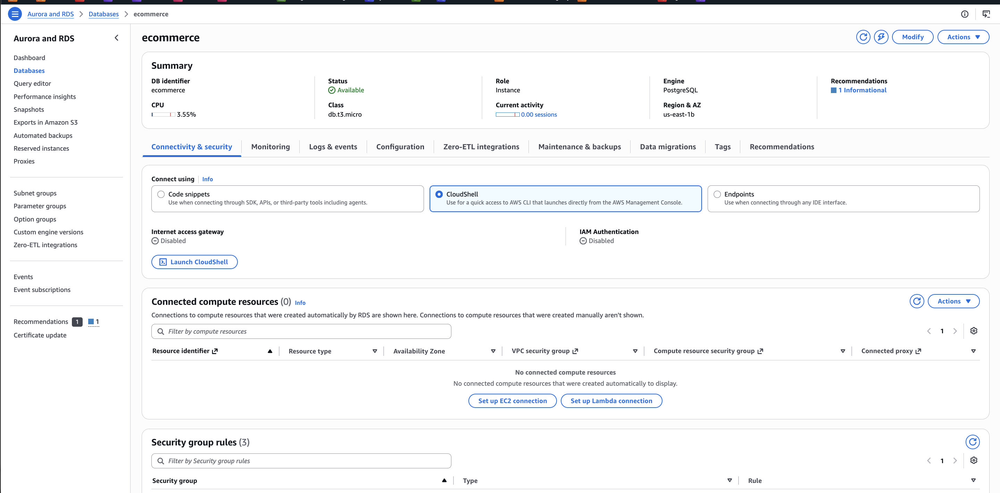

*The database is now fully initialized and locked down again, isolated from everything except the backend ECS tasks via their designated security rules.*
---

## 🔐 Phase 4: Security & Credentials Management

### 1. Create Database Secrets in AWS Secrets Manager
Before launching the database, we must store its credentials securely.

1. Open the **AWS Secrets Manager Console** and click **Store a new secret**.
2. Choose **Secret type:** `Amazon RDS database`.
3. Input the following Key/Value credentials:
   * **username:** `db_admin` *(the one you used in rds creation)*
   * **password:** `ChooseAStrongPassword123!` *(the one you used in rds creation)*
   * **engine:** `postgres`
   * **port:** `5432`
   * **host:** `ecommerce.********.us-east-1.rds.amazonaws.com` *(Your RDS endpoint)*
   * **dbInstanceIdentifier:** `ecommerce`
   *  **dbname:** `ecommerce`
4. Click **Next**.
5. **Secret name:** Type exactly `rds_secrets`.
6. Leave other settings as default and click **Store**.

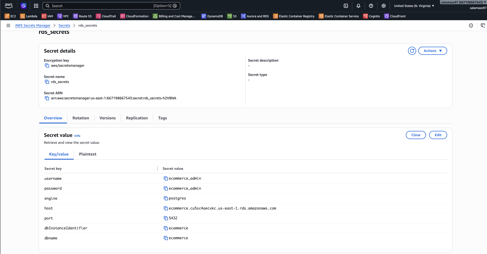

---

## 🗄️ Phase 5: Persistent Storage (S3 Buckets Setup)

Create the Backend Media Bucket (Public Read for Product Images)
Since the application fetches and displays product images via direct HTTP URLs, this bucket must allow public read access while restricting write permissions.

1. Click **Create bucket**.
2. **Bucket name:** `econom-store-media-12345`.
3. **Block Public Access settings for this bucket:** **Uncheck** "Block *all* public access" *(Required to let the browser fetch product images via direct URLs)*. Check the acknowledgement box.
4. Click **Create bucket**.
5. Go to the **Permissions** tab -> **Bucket Policy** -> Click **Edit** and paste the public read policy for this bucket:
```json
{
    "Version": "2012-10-17",
    "Statement": [
        {
            "Sid": "PublicReadForImages",
            "Effect": "Allow",
            "Principal": "*",
            "Action": "s3:GetObject",
            "Resource": "arn:aws:s3:::econom-store-media-xxxxxxxx/*"
        }
    ]
}
```
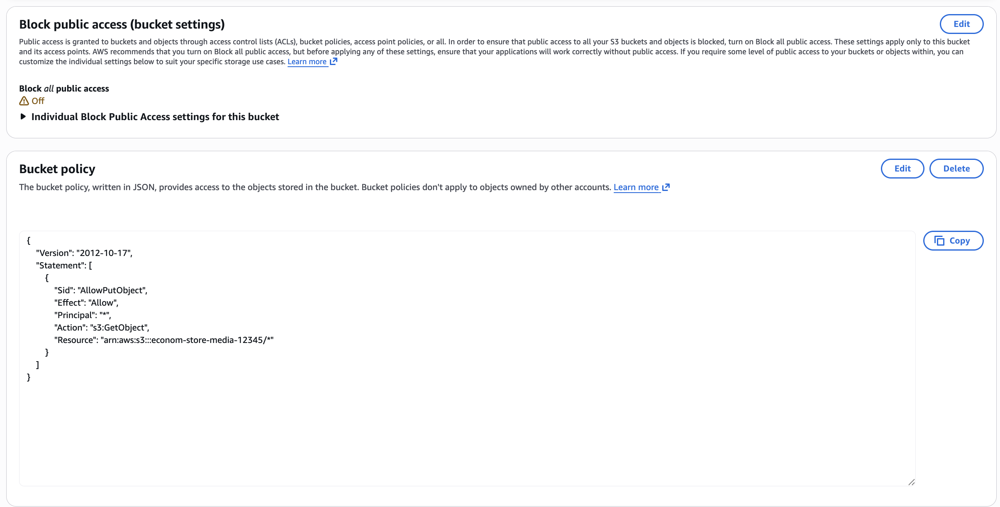

6. On the same **Permissions** tab -> Scroll down to **Cross-origin resource sharing (CORS)** -> Click **Edit** and paste:
```json
[
    {
        "AllowedHeaders": ["*"],
        "AllowedMethods": ["GET", "POST", "PUT"],
        "AllowedOrigins": ["[https://yourdomin.com](https://yourdomin.com)"],
        "ExposeHeaders": ["ETag"]
    }
]
```
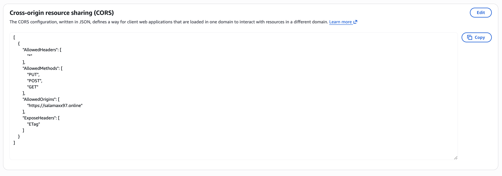
---

## 🆔 Phase 6: Identity Verification (AWS Cognito Setup)

1. Open the **AWS Cognito Console** and click **Create user pool**.
2. **Configure sign-in experience:** Select **Email**. Click Next.
3. **Configure security requirements:** Keep defaults (Multi-factor authentication optional). Click Next.
4. **Configure sign-up experience:** Keep defaults. Click Next.
5. **Configure message delivery:** Select **Send email with Cognito** for testing. Click Next.
6. **Integrate your application:**
   * **User pool name:** `cloud-store-user-pool`
   * **Hosted UI:** Select **Use the Cognito Hosted UI**.
   * **Cognito domain:** Select **Use a Cognito domain** and enter `cloud-store-auth-domain`.
   * **Initial app client:** Select **Public client**.
   * **App client name:** `react-frontend-client`.
   * **Allowed callback URLs:** Enter `https://yourdomin.com`.
   * **Allowed sign-out URLs:** Enter `https://yourdomin.com`.
7. Click **Create user pool**. Note down the generated **Client ID**.

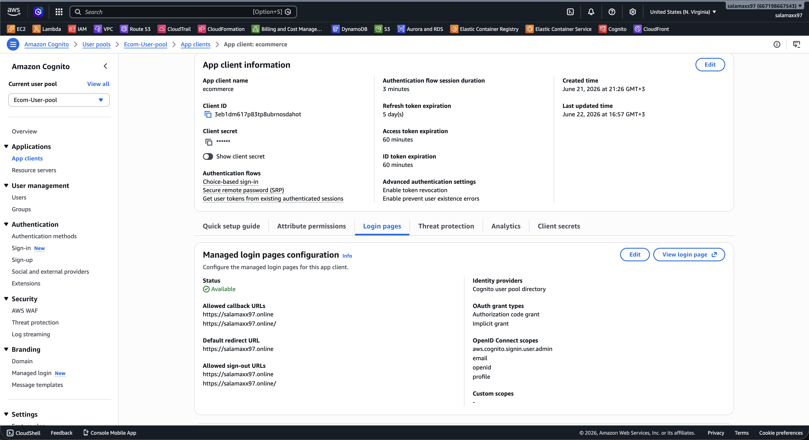

---
## 🚢 Phase 7: Application Load Balancer (ALB) Configuration

We will deploy a single Internet-facing ALB to act as our central entry point, routing traffic to both our Frontend and Backend ECS tasks based on domain names (Host Headers).

### 1. Create Target Groups
Before launching the ALB, we must define where the traffic will be sent.
1. Open the **EC2 Console** -> **Target Groups** -> Click **Create target group**.
2. **Backend Target Group (`ecs-backend-tg`):**
   * Target type: `IP`
   * Target group name: `ecs-backend-tg`
   * Protocol: `HTTP` | Port: `8080`
   * VPC: Select `cloud-store-vpc`
   * Health checks path: `/api/health` *(or `/` depending on your backend health endpoint)*
   * Click **Next** and click **Create target group**.
3. **Frontend Target Group (`ecs-frontend-tg`):**
   * Target type: `IP`
   * Target group name: `ecs-frontend-tg`
   * Protocol: `HTTP` | Port: `80` *(Nginx default internal container port)*
   * VPC: Select `cloud-store-vpc`
   * Health checks path: `/`
   * Click **Next** and click **Create target group**.

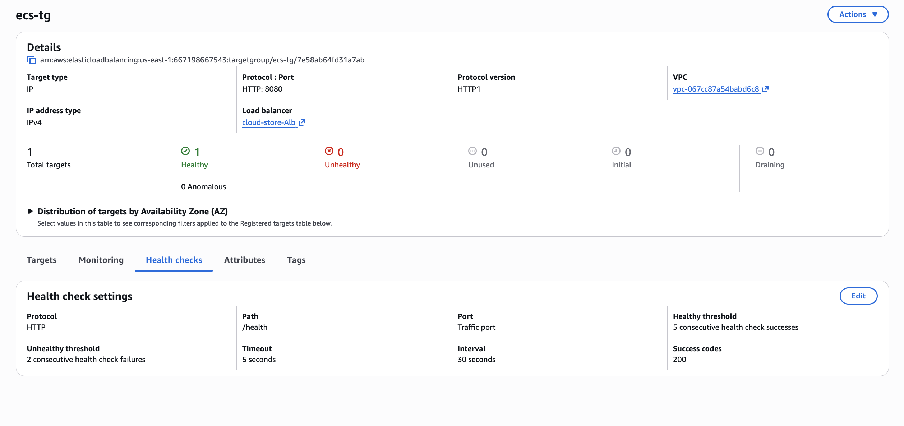
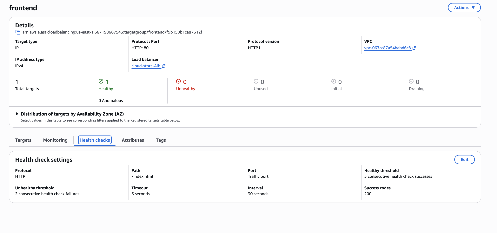

### 2. Provision the ALB
1. Navigate to **EC2 Console** -> **Load Balancers** -> Click **Create Load Balancer** -> Select **Application Load Balancer**.
2. **Basic configuration:**
   * Load balancer name: `cloud-store-alb`
   * Scheme: `Internet-facing`
   * IP address type: `IPv4`
3. **Network mapping:**
   * VPC: Select `cloud-store-vpc`
   * Mappings: Select both **Public Subnets** (one in `us-east-1a` and one in `us-east-1b`).
4. **Security groups:** Uncheck default and select **`sg_alb`** *(created in Phase 2)*.
5. **Listeners and Routing:**
   * **Listener 1:** Protocol `HTTP` | Port `80` -> Set action to **Redirect to URL** -> Port `443` (Enforces HTTPS).
   * **Listener 2:** Protocol `HTTPS` | Port `443` -> Forward to `ecs-frontend-tg` (Default group).
   * **Secure listener settings:** Select your validated **AWS Certificate Manager (ACM)** SSL certificate covering `yourdomain.com` and `*.yourdomain.com`.
6. Click **Create load balancer**.
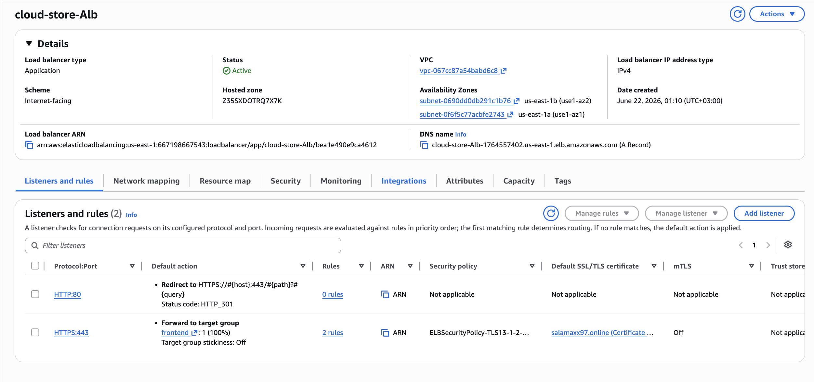

   
### 3. Configure Host-Based Routing Rules
To split traffic between frontend and backend on the same ALB:
1. Open your ALB -> Go to the **Listeners and rules** tab -> Click on the `HTTPS:443` listener.
2. Click **Manage rules** -> **Add rule**.
3. **Rule Name:** `Route-To-Backend-API`
4. **Condition:** Add condition -> **Host header** -> Enter `api.yourdomain.com`.
5. **Action:** Forward to target group -> Select **`ecs-backend-tg`**.
6. Save the rule. Ensure the default rule at the bottom remains forwarding everything else to **`ecs-frontend-tg`**.

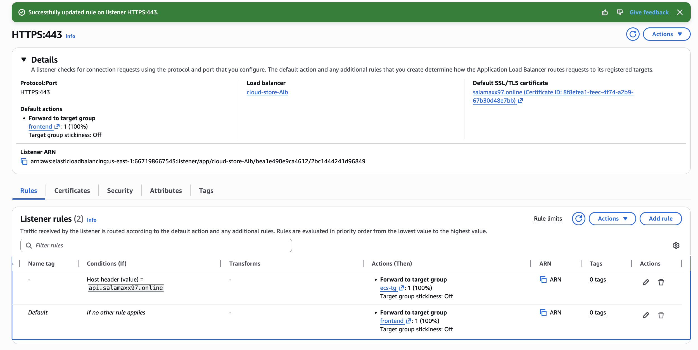
---

## 🌐 Phase 8: Domain Management via Route 53

We need to point our custom domains directly to the Application Load Balancer DNS name.

1. Open the **Route 53 Console** -> Click **Hosted zones** -> Select `yourdomain.com`.
2. **Create Record for Frontend:**
   * Record name: Leave blank *(or type `www` if using a subdomain)*
   * Record type: `A - Routes traffic to an IPv4 address and some AWS resources`
   * **Alias:** Toggle the switch to **Enabled**.
   * Route traffic to: Choose **Alias to Application and Network Load Balancer**.
   * Region: Select `us-east-1`.
   * Choose Load Balancer: Select `cloud-store-alb`.
   * Click **Create records**.
3. **Create Record for Backend API:**
   * Click **Create record**.
   * Record name: Type `api`
   * Record type: `A`
   * **Alias:** Toggle to **Enabled**.
   * Route traffic to: Choose **Alias to Application and Network Load Balancer** -> `us-east-1` -> `cloud-store-alb`.
   * Click **Create records**.

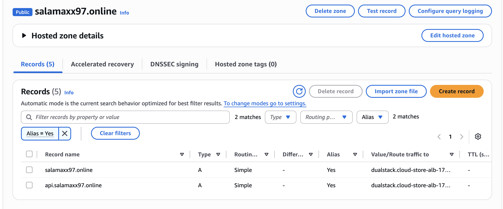

---

## 📦 Phase 9: Container Registries & Local Image Compilation

We will build docker containers for both tiers locally and push them to isolated Amazon Elastic Container Registry (ECR) repositories.

### 1. Create ECR Repositories
1. Open the **Amazon ECR Console** -> Click **Create repository**.
   * Visibility settings: `Private`
   * Repository name: `cloud-store-backend`
   * Click **Create**.
2. Click **Create repository** again.
   * Visibility settings: `Private`
   * Repository name: `cloud-store-frontend`
   * Click **Create**.
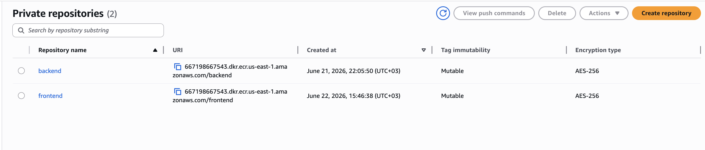

### 2. Local Frontend File Modifications & Build
Before dockerizing the frontend, we must configure it to talk to our live Route 53 production API domain.

1. Open your local project files and navigate to `frontend/src/App.js` *(or your environment configuration file)*.
2. Update the values directly with your production infrastructure endpoints:
```javascript
const API_BASE_URL = "[https://api.yourdomain.com/](https://api.yourdomain.com/)";
const COGNITO_DOMAIN = "[https://cloud-store-auth-domain.auth.us-east-1.amazoncognito.com](https://cloud-store-auth-domain.auth.us-east-1.amazoncognito.com)";
const CLIENT_ID = "cogito_client_id";
const REDIRECT_URI = "[https://yourdomain.com](https://yourdomain.com)";
```

### 3. Dockerize & Push Both Tiers to AWS ECR
Open your terminal on your local development machine, authenticate your Docker daemon with AWS, and execute the builds:

```bash
# 1. Authenticate local Docker with your remote AWS ECR Registry
aws ecr get-login-password --region us-east-1 | docker login --username AWS --password-stdin <YOUR_AWS_ACCOUNT_ID>.dkr.ecr.us-east-1.amazonaws.com

# ==================== BACKEND BUILD & PUSH ====================
# 2. Build the backend image
docker build -t cloud-store-backend ./cloud_stor_api 
*(use docker build --platform linux/amd64 if you build on another platform to be compatable with ecs task)*

# 3. Tag image for ECR
docker tag cloud-store-backend:latest <YOUR_AWS_ACCOUNT_ID>[.dkr.ecr.us-east-1.amazonaws.com/cloud-store-backend:latest](https://.dkr.ecr.us-east-1.amazonaws.com/cloud-store-backend:latest)

# 4. Push backend image to ECR
docker push <YOUR_AWS_ACCOUNT_ID>[.dkr.ecr.us-east-1.amazonaws.com/cloud-store-backend:latest](https://.dkr.ecr.us-east-1.amazonaws.com/cloud-store-backend:latest)

# ==================== FRONTEND BUILD & PUSH ====================
# 5. Build the frontend image (Ensure your project has a production Dockerfile leveraging Nginx)
docker build -t cloud-store-frontend ./ReactFrontend

# 6. Tag image for ECR
docker tag cloud-store-frontend:latest <YOUR_AWS_ACCOUNT_ID>[.dkr.ecr.us-east-1.amazonaws.com/cloud-store-frontend:latest](https://.dkr.ecr.us-east-1.amazonaws.com/cloud-store-frontend:latest)

# 7. Push frontend image to ECR
docker push <YOUR_AWS_ACCOUNT_ID>[.dkr.ecr.us-east-1.amazonaws.com/cloud-store-frontend:latest](https://.dkr.ecr.us-east-1.amazonaws.com/cloud-store-frontend:latest)
```

---

## 📄 Phase 10: IAM Roles & ECS Fargate Task Definitions

Before deploying our containers, we must establish the identity roles (IAM) that grant our containers permission to interact with AWS services, then configure the blueprints (Task Definitions) for both tiers via the AWS Console UI.

### 1. Configure Necessary IAM Roles
ECS Fargate requires two distinct types of roles:
1. **Task Execution Role (`ecsTaskExecutionRole`):** Used by the ECS Agent *before* the container runs (to pull images from ECR and create CloudWatch Log streams).
   * **Required Policy:** Attach the AWS-managed policy `AmazonECSTaskExecutionRolePolicy`.

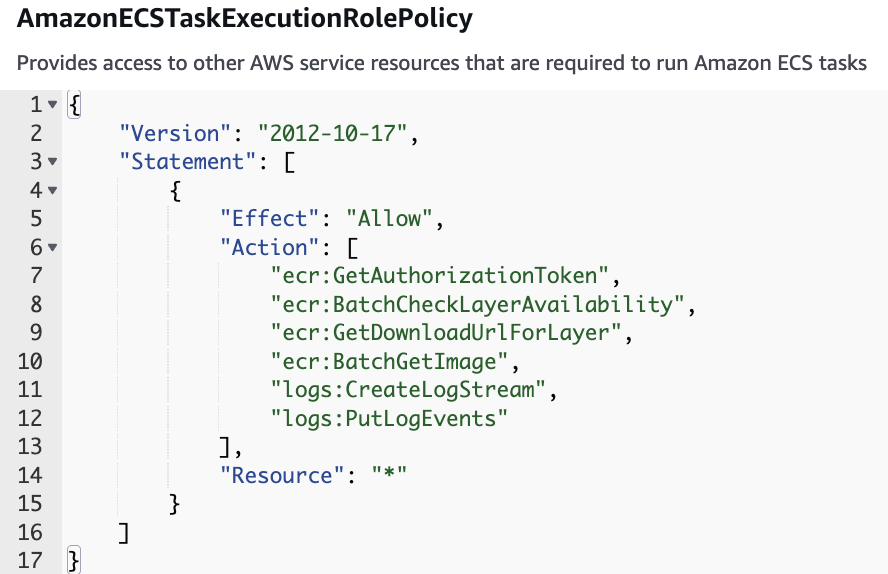

2. **Task Role (`ecsTaskRole`):** Used by your backend application *at runtime* (to read credentials from Secrets Manager and interact with S3).
   * **Required Permissions:** Attach a custom inline policy allowing `secretsmanager:GetSecretValue` for `rds_secrets` and `s3:*` for your media bucket.

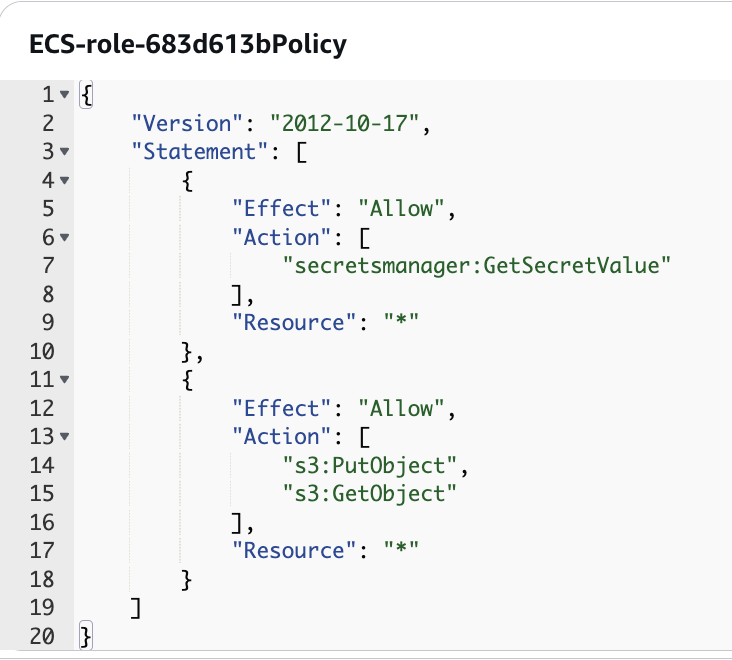

---

### 2. Create the Frontend Task Definition 
1. Open the **Amazon ECS Console** -> Navigation pane -> **Task definitions** -> Click **Create new task definition**.
2. **Task definition configuration:**
   * **Task definition family:** Type `frontend`
   * **Infrastructure requirements:** Select **AWS Fargate**.
   * **Operating system/Architecture:** `Linux/X86_64`
   * **Task size:** CPU: `1 vCPU` (`1024`) | Memory: `3 GB` (`3072`)
   * **Task roles:** * *Task role:* Select `ecsTaskRole` *(or leave blank if no runtime AWS SDK calls are made from frontend)*.
     * *Task execution role:* Select `ecsTaskExecutionRole`.
3. **Container-1 Configuration (`econom_frontend`):**
   * **Name:** `econom_frontend`
   * **Image URI:** `<YOUR_AWS_ACCOUNT_ID>.dkr.ecr.us-east-1.amazonaws.com/cloud-store-frontend:latest`
   * **Essential container:** Keep **Turned on** (Yes).
   * **Port mappings:** * Container port: `80` | Host port: `80`
     * Protocol: `TCP` | App protocol: `HTTP`
4. **Log collection:**
   * Check **Use log collection**.
   * Log driver: `awslogs`
   * Options: Set Key `awslogs-group` to value `/ecs/frontend` and Key `awslogs-create-group` to `true`.
5. Scroll to the bottom and click **Create**.

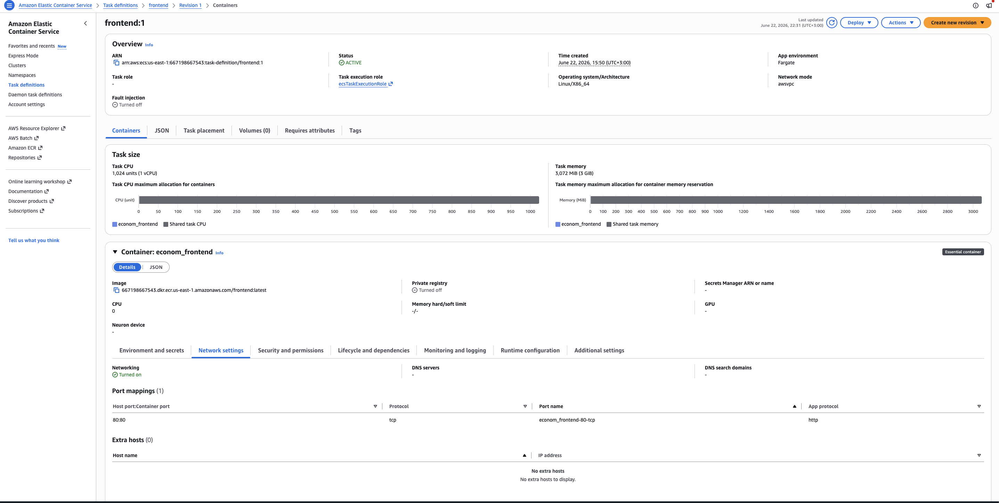

---

### 3. Create the Backend Task Definition 
1. Navigate back to **Task definitions** -> Click **Create new task definition**.
2. **Task definition configuration:**
   * **Task definition family:** Type `backend`
   * **Infrastructure requirements:** Select **AWS Fargate**.
   * **Operating system/Architecture:** `Linux/X86_64`
   * **Task size:** CPU: `1 vCPU` (`1024`) | Memory: `3 GB` (`3072`)
   * **Task roles:**
     * *Task role:* Select `ecsTaskRole` *(Required for application logic to read secrets/S3)*.
     * *Task execution role:* Select `ecsTaskExecutionRole`.
3. **Container-1 Configuration (`econom_backend`):**
   * **Name:** `econom_backend`
   * **Image URI:** `<YOUR_AWS_ACCOUNT_ID>.dkr.ecr.us-east-1.amazonaws.com/cloud-store-backend:latest`
   * **Essential container:** Keep **Turned on** (Yes).
   * **Port mappings:**
     * Container port: `8080` | Host port: `8080`
     * Protocol: `TCP` | App protocol: `HTTP`
4. **Environment variables:** Scroll down to the Environment variables section and add the following **7 keys** manually as **Value**:
   * `AWS_REGION` = `us-east-1`
   * `ENVIRONMENT` = `production`
   * `DB_SECRET_NAME` = `rds_secrets`
   * `MEDIA_BUCKET_NAME` = `econom-store-media-12345`
   * `CORS_ORIGINS` = `https://yourdomain.com`
   * `COGNITO_CLIENT_ID` = `your-cognito-client-id`
   * `COGNITO_JWKS_URL` = `https://cognito-idp.us-east-1.amazonaws.com/us-east-1_xxxxx.well-known/jwks.json`
5. **Log collection:**
   * Check **Use log collection**.
   * Log driver: `awslogs`
   * Options: Set Key `awslogs-group` to value `/ecs/econom_backend` and Key `awslogs-create-group` to `true`.
6. Scroll to the bottom and click **Create**.

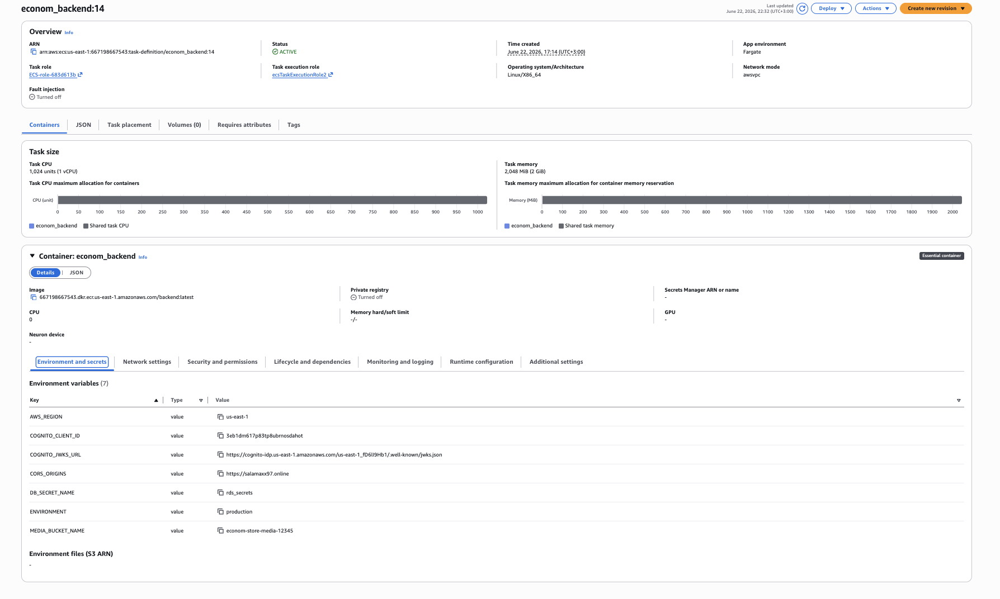

---

## 🏛️ Phase 11: Compute Cluster & Services Deployment

We will build our container cluster environment and run our defined tasks continuously using ECS Services mapped behind our ALB.

### 1. Create the ECS Cluster
1. Open the **Amazon ECS Console** -> **Clusters** -> Click **Create cluster**.
2. **Cluster name:** `cloud-store-cluster`
3. **Infrastructure:** Check **AWS Fargate (serverless)**.
4. Click **Create**.

### 2. Deploy the Backend Service
1. Inside `cloud-store-cluster` -> Go to the **Services** tab -> Click **Create**.
2. Configure Deployment settings:
   * **Compute options:** Capacity Provider Strategy -> Select `FARGATE`.
   * **Application type:** `Service`.
   * **Family:** Choose `backend` | Revision: `Latest`.
   * **Service name:** `backend-service`
   * **Desired tasks:** `2` *(Ensures high availability across AZs)*.
3. **Networking Configuration:**
   * VPC: Select `cloud-store-vpc`.
   * Subnets: Select **only the 2 Private App Subnets** *(Isolates the containers from direct public exposure)*.
   * Security group: Choose Existing -> Select **`sg_ECS_backend`**.
   * Public IP: Select **Turned off** *(Tasks run in private networks and pull via NAT Gateway)*.
4. **Load balancing:**
   * Load balancer type: `Application Load Balancer`.
   * Load balancer name: Select `cloud-store-alb`.
   * Container to load balance: Select `econom_backend : 8080 : 8080`.
   * Target group: Choose Existing -> Select **`ecs-backend-tg`**.
5. Click **Create**.

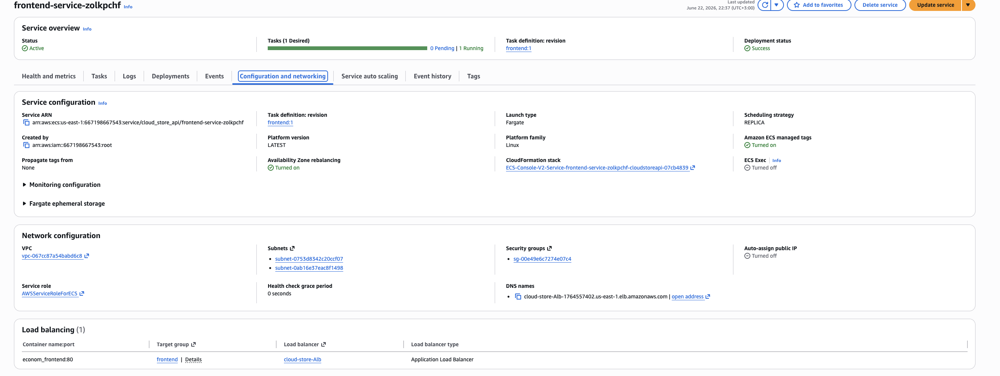

### 3. Deploy the Frontend Service
1. Inside the cluster **Services** tab -> Click **Create**.
2. Configure settings:
   * **Compute options:** `FARGATE`.
   * **Family:** Choose `frontend` | Revision: `Latest`.
   * **Service name:** `frontend-service`
   * **Desired tasks:** `2`.
3. **Networking Configuration:**
   * VPC: `cloud-store-vpc`.
   * Subnets: Select **the 2 Private App Subnets**.
   * Security group: Choose Existing -> Select **`sg_ECS_frontend`**.
   * Public IP: Select **Turned off**.
4. **Load balancing:**
   * Load balancer type: `Application Load Balancer`.
   * Load balancer name: `cloud-store-alb`.
   * Container to load balance: Select `econom_frontend : 80 : 80`.
   * Target group: Choose Existing -> Select **`ecs-frontend-tg`**.
5. Click **Create**.

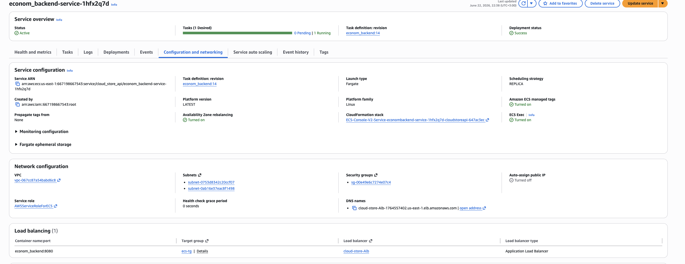

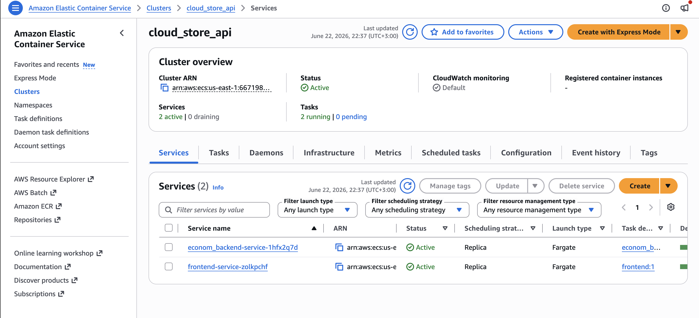

## 🎯 Phase 12: End-to-End Production Verification (Live Browser Demo)

To validate that our containerized full-stack architecture, secure networking, and domain routing are operating perfectly, perform the following verification checks in your browser.

### 1. Secure Frontend Access & Domain Routing (HTTPS Check)
1. Open your browser and navigate to your production domain: `https://yourdomain.com`
2. Verify that the SSL padlock icon is active next to the URL, proving that the ALB is successfully handling SSL termination using the ACM certificate.

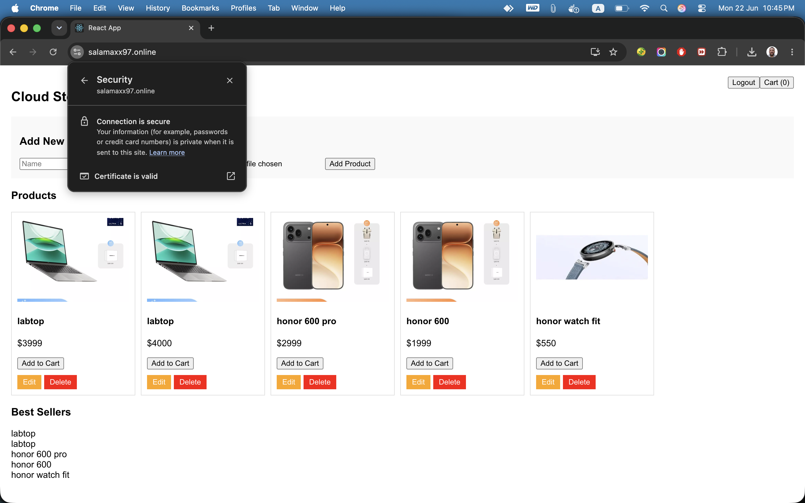

---

### 2. Identity Authentication via AWS Cognito Hosted UI
1. Click on the **Login** / **Sign In** button on the frontend.
2. Ensure you are redirected to the secure AWS Cognito Hosted UI domain (`https://cloud-store-auth-domain.auth.us-east-1.amazoncognito.com...`).
3. Log in with a test user and ensure you are seamlessly redirected back to your main site as an authenticated session.

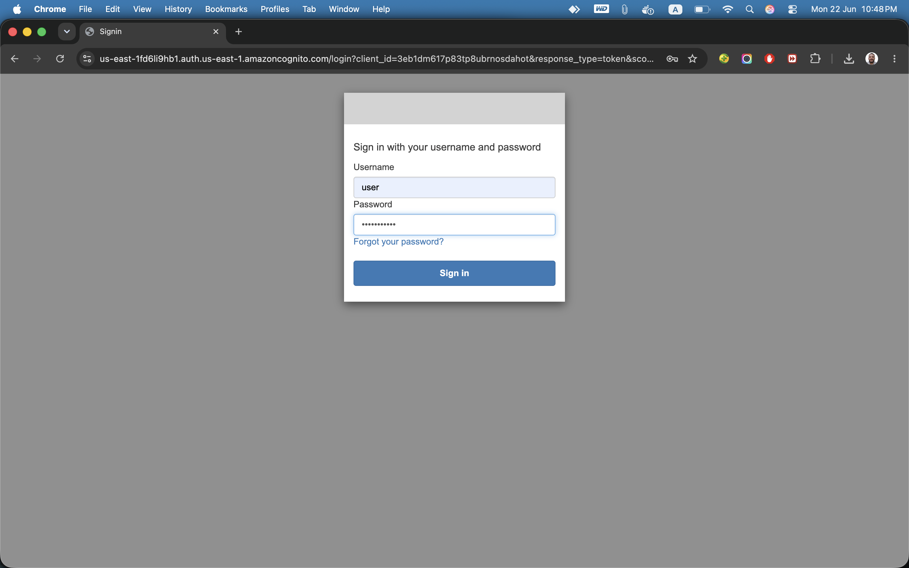

---

### 3. API Communication & Live Data Fetching (Network Tab)
1. On the homepage, open your Browser Developer Tools (**F12** or `Ctrl+Shift+I`) and switch to the **Network** tab.
2. Refresh the page to trigger a backend data fetch.
3. Verify that the frontend container is successfully firing an HTTP `GET` request to the backend domain: `https://api.yourdomain.com/api/products` and receiving an HTTP status code **`200 OK`**.

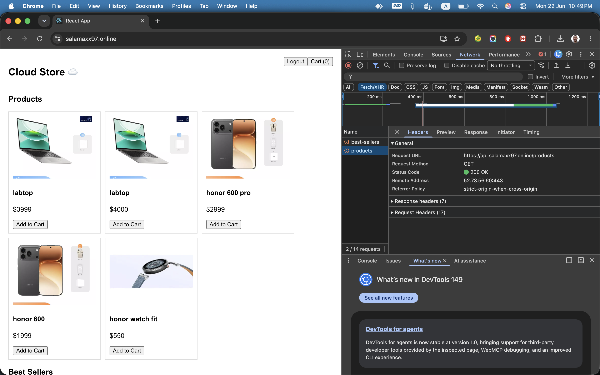


---

### 4. Media Upload & S3 Private Access via Presigned URLs
1. Navigate to the admin dashboard and click **Add Product** / **Upload Image**.
2. Upload a product image asset. The backend (`econom_backend`) will process the file, store it securely in the private S3 bucket, and write the record to Amazon RDS.
3. Inspect the newly uploaded product image element in your browser:
   * Notice that the image `src` contains a dynamic **Presigned URL** parameter appended with cryptographic tokens (`?AWSAccessKeyId=...&Expires=...`).
   * This confirms the bucket remains strictly **Private**, yet authenticated clients can view images seamlessly!

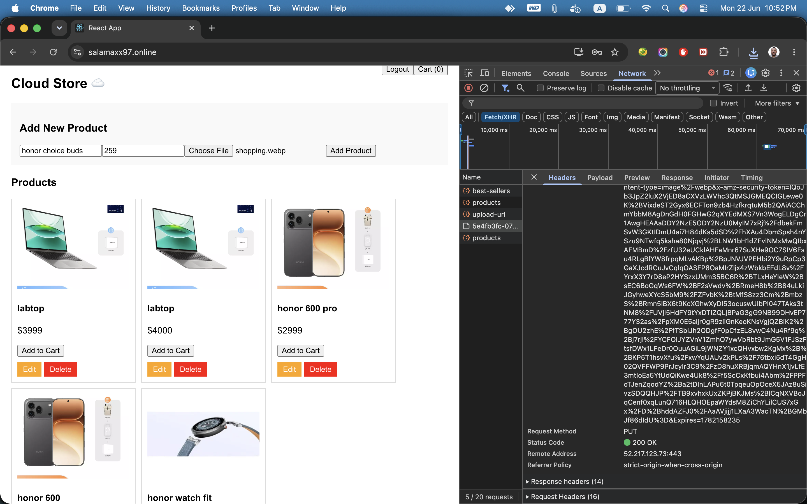
