# 🛒 Cloud-Store
### Production-Ready Cloud-Native E-Commerce Platform on AWS

Cloud-Store is a production-grade cloud-native e-commerce platform designed to demonstrate modern AWS architecture, security best practices, high availability, scalability, observability, and event-driven serverless processing.

The project combines containerized microservices running on Amazon ECS Fargate with a fully serverless checkout workflow powered by API Gateway, Lambda, Amazon SQS, SNS, and Amazon RDS.

The entire infrastructure follows AWS Well-Architected Framework principles including:

- High Availability
- Multi-AZ Deployment
- Security by Design
- Event-Driven Architecture
- Infrastructure Isolation
- Container Orchestration
- Scalable Networking
- Production Monitoring

---

# 📑 Table of Contents

- [Project Overview](#-project-overview)
- [Architecture](#%EF%B8%8F-architecture)
- [Technology Stack](#-technology-stack)
- [Core Features](#-core-features)
- [Deployment Steps](#-deployment-steps)
- [Future Improvements](#-future-improvements)
- [License](#-license)

---

# 🚀 Project Overview

Cloud-Store demonstrates how a modern e-commerce platform can be built using multiple AWS services while maintaining:

- Highly Available Infrastructure
- Secure Network Segmentation
- Private Application Deployment
- Containerized Services
- Serverless Event Processing
- Asynchronous Checkout Workflow
- Identity Management
- Secure Secret Management
- Centralized Monitoring
- Scalable Storage

Instead of deploying everything inside a single application server, every layer of the platform has its own responsibility.

---

# 🏗️ Architecture

The project is divided into three major architecture layers.

## 1. High-Level Architecture
This diagram illustrates the complete AWS environment and how all major services interact together.

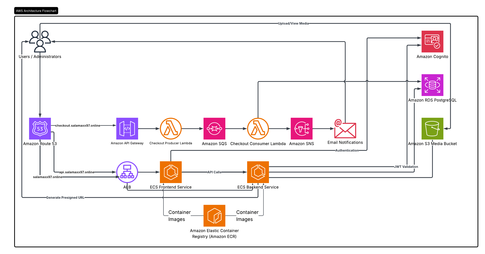

---

## 2. Application Container Architecture
This architecture focuses on the containerized application running on Amazon ECS Fargate.

It demonstrates:
- Route53 & Domain Mapping
- AWS WAF & CloudFront Protection
- Application Load Balancer (ALB) Routing
- ECS Fargate Cluster (Frontend & Backend Services)
- Amazon RDS PostgreSQL (Isolated Database)
- Secure Credentials via AWS Secrets Manager
- Object Storage via Amazon S3
- User Directory via Amazon Cognito
- Observability via Amazon CloudWatch Logs & Metrics
- Private Network Access via NAT Gateways & VPC Endpoints

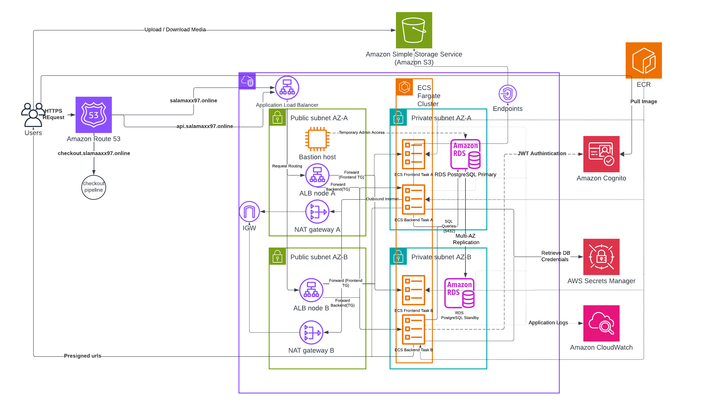

---

## 3. Serverless Checkout Architecture
The checkout process is completely decoupled from the main application using an event-driven architecture.

The workflow consists of:
1. Client sends checkout request.
2. API Gateway authenticates the user via Cognito JWT validation.
3. Producer Lambda validates and pushes the order asynchronously into Amazon SQS.
4. Consumer Lambda handles safe VPC injection to process the queue records.
5. Order data is committed inside the isolated database tier.
6. SNS broadcasts automated order confirmation updates.
7. Client receives an immediate, non-blocking asynchronous response.

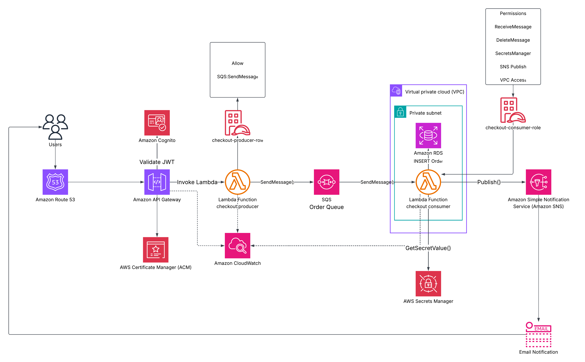

---

# 🛠️ Technology Stack

## Networking & Edge
- Amazon VPC (Custom Network Partition)
- Public & Private Subnets
- Internet Gateway (IGW) & NAT Gateways
- AWS VPC Endpoints (PrivateLink)
- Route53
- Application Load Balancer (ALB)

## Compute & Orchestration
- Amazon ECS Fargate (Serverless Container Platform)
- AWS Lambda (Serverless Compute Functions)

## Container Management
- Docker (Containerization Tool)
- Amazon ECR (Elastic Container Registry)

## Database & Storage
- Amazon RDS PostgreSQL (Multi-AZ High Availability Deployment)
- Amazon S3 (Simple Storage Service for Static Media Assets)

## Identity & Security
- Amazon Cognito (User Authentication & Federated Access)
- AWS Secrets Manager (Dynamic Credentials Injection)
- AWS IAM (Least Privilege Role Assignments)
- AWS WAF (Web Application Firewall Protection)
- AWS Certificate Manager (ACM SSL/TLS Certificates)

## Messaging & Queuing
- Amazon SQS (Simple Queue Service for Decoupling)
- Amazon SNS (Simple Notification Service for Event Publishing)

## Monitoring & Observability
- Amazon CloudWatch (Centralized Metrics & Logs Storage)

---

# ✨ Core Features

- Production-ready Custom VPC architecture with segmented public/private layers.
- Multi-AZ structural redundancy ensuring high availability across all single-point dependencies.
- Auto-healing and dynamically scale-ready containerized microservices using ECS Fargate tasks.
- Network security lockouts limiting internal traffic entirely behind private subnet groups.
- Local multi-platform container compilation and deployment pipeline mapped directly into AWS ECR.
- Token-based identity management and OAuth workflows powered seamlessly by Amazon Cognito.
- Cryptographically protected database access tokens securely managed via AWS Secrets Manager.
- High-performance, object-level public retrieval paths and access rules for static S3 assets.
- Highly resilient event-driven architecture built to absorb sudden checkout user spikes.
- Asynchronous database workers operating safely inside interior enterprise networks.
- CloudWatch performance alarms, pipeline trace points, and decoupled logging boundaries.

---
# 🚀 Deployment Steps

## 🛠️ Phase 1: Networking & Core VPC Setup
We will isolate our application components using a Custom VPC spanning two Availability Zones (AZs).

### 1. Create the Custom VPC
1. Open the **AWS VPC Console**.
2. Click **Create VPC** and select **VPC and more**.
3. Configure the following settings:
   * **Name tag project:** `cloud-store-vpc`
   * **IPv4 CIDR block:** `10.0.0.0/16`
   * **Number of Availability Zones (AZs):** `2` *(Select us-east-1a and us-east-1b)*
   * **Number of Public Subnets:** `2` *(CIDRs: 10.0.1.0/24, 10.0.2.0/24)* For ALB internet Facing .
   * **Number of Private Subnets:** `2` 
     * *App and DB Tier:* `2` Private Subnets (CIDRs: `10.0.11.0/24`, `10.0.12.0/24`)
   * **NAT Gateways ($):** Select **1 per AZ** *(To ensure high availability for private app tasks pulling updates) Or regional NAT Gateway*.
   * **VPC Endpoints:** Select **S3 Gateway** *(To optimize internal S3 routing without using NAT traffic)*.
4. Click **Create VPC**.


---
## 🛡️ Phase 2: Security Groups & Network Firewalls
To restrict traffic flow according to strict security standards, we will create layered Security Groups (SGs) where each tier only trusts the tier directly preceding it.

### 1. Create the Application Load Balancer Security Group (`sg_alb`)
1. Open the **VPC Console** -> **Security Groups** -> Click **Create security group**.
2. Configure the following:
   * **Security group name:** `sg_alb`
   * **Description:** Allow public web traffic to the ALB.
   * **VPC:** Select `cloud-store-vpc`.
3. **Inbound rules:** Add the following two rules:
   * **Rule 1:** Type: `HTTP` | Port: `80` | Source: `Anywhere-IPv4` (`0.0.0.0/0`)
   * **Rule 2:** Type: `HTTPS` | Port: `443` | Source: `Anywhere-IPv4` (`0.0.0.0/0`)
4. Click **Create security group**.

### 2. Create the ECS Frontend Task Security Group (`sg_ECS_frontend`)
1. Click **Create security group**.
2. Configure the following:
   * **Security group name:** `sg_ECS_frontend`
   * **Description:** Allow traffic exclusively from the ALB on port 80.
   * **VPC:** Select `cloud-store-vpc`.
3. **Inbound rules:**
   * Type: `Custom TCP` | Port: `80` | Source: Custom -> Search and select `sg_alb`.
4. Click **Create security group**.

### 3. Create the ECS Backend Task Security Group (`sg_ECS_backend`)
1. Click **Create security group**.
2. Configure the following:
   * **Security group name:** `sg_ECS_backend`
   * **Description:** Allow API requests exclusively from the ALB on port 8080.
   * **VPC:** Select `cloud-store-vpc`.
3. **Inbound rules:**
   * Type: `Custom TCP` | Port: `8080` | Source: Custom -> Search and select `sg_alb`.
4. Click **Create security group**.

### 4. Create the Database Security Group (`sg_RDS`)
1. Click **Create security group**.
2. Configure the following:
   * **Security group name:** `sg_RDS`
   * **Description:** Isolate database access exclusively to the ECS backend instances.
   * **VPC:** Select `cloud-store-vpc`.
3. **Inbound rules:**
   * Type: `PostgreSQL` *(or Custom TCP)* | Port: `5432` | Source: Custom -> Search and select `sg_ECS_backend`.
4. Click **Create security group**.

---

## 🛢️ Phase 3: Database Provisioning (Amazon RDS Multi-AZ)

### 1. Database instance creation
1. Open the **Amazon RDS Console** and click **Create database**.
2. **Choose a database creation method:** `Standard create`.
3. **Engine options:** `PostgreSQL`.
4. **Templates:** Select `Dev/Test` *(Dev/Test for budget-friendly multi-AZ testing)*.
5. **Deployment options:** Select **Multi-AZ DB instance** *(Creates a primary instance in AZ-A and a standby instance in AZ-B)*.
6. **Settings:**
   * **DB instance identifier:** `ecommerce`
   * **Master username & password:** *(Must match the values you typed into Secrets Manager exactly)*.
7. **Connectivity:**
   * **Virtual private cloud (VPC):** Select `ecommerce`.
   * **VPC security group:** Select->  `rds-sg`.
8. Click **Create database**. 

### 2. Database Schema & Tables Initialization via Bastion Host (Temporary Access)
Since the Amazon RDS instance is strictly isolated within Private Subnets, it is not accessible from the public internet. To create the database and tables securely, we temporarily grant access to a **Bastion Host** inside the public subnet to execute the SQL initialization commands.

#### Step 1: Temporarily Update RDS Security Group
1. Open the **EC2 Console** -> **Security Groups** -> Select your RDS Security Group (`sg_rds`).
2. Go to the **Inbound Rules** tab -> Click **Edit inbound rules**.
3. Add a temporary rule:
   * **Type:** `PostgreSQL` (Port `5432`)
   * **Source:** Custom -> Select your Bastion Host Security Group (`sg_bastion`).
4. Click **Save rules**.

#### Step 2: Connect to the Bastion Host & Initialize Database
1. SSH into your live Bastion Host EC2 instance (or use EC2 Instance Connect via AWS Console).
2. Ensure the PostgreSQL client tool (`psql`) is installed on the Bastion Host. If not, install it using:
   ```bash
   sudo amazon-linux-extras install postgresql14 -y  # For Amazon Linux 2
   # or: sudo dnf install postgresql15 -y for AL2023
   ```
3. Connect to your blank RDS PostgreSQL instance from the Bastion terminal:
   ```bash
   psql -h <YOUR_RDS_ENDPOINT> -U <MASTER_USERNAME> -d postgres
   ```
4. Enter your master password when prompted.
5. Once connected, execute your SQL scripts or raw commands to create the application database and its tables:
   ```sql
   -- Create the application database
   CREATE DATABASE ecommerce_db;
   \c ecommerce_db;

   -- Execute your table creation schemas
   CREATE TABLE products (
       id SERIAL PRIMARY KEY,
       name VARCHAR(255) NOT NULL,
       price NUMERIC NOT NULL,
       image_url TEXT
   );
   -- (Add the rest of your table schemas here...)
   ```
6. Type `\q` and press Enter to exit the PostgreSQL prompt.

#### Step 3: Re-lock and Secure the Database
1. Go back immediately to the **EC2 Console** -> **Security Groups** -> Select `sg_rds`.
2. Click **Edit inbound rules**.
3. **Delete** the temporary rule you added in Step 1 that allowed traffic from `sg_bastion`.
4. Click **Save rules**. 


*The database is now fully initialized and locked down again, isolated from everything except the backend ECS tasks via their designated security rules.*
---

## 🔐 Phase 4: Security & Credentials Management

### 1. Create Database Secrets in AWS Secrets Manager
Before launching the database, we must store its credentials securely.

1. Open the **AWS Secrets Manager Console** and click **Store a new secret**.
2. Choose **Secret type:** `Amazon RDS database`.
3. Input the following Key/Value credentials:
   * **username:** `db_admin` *(the one you used in rds creation)*
   * **password:** `ChooseAStrongPassword123!` *(the one you used in rds creation)*
   * **engine:** `postgres`
   * **port:** `5432`
   * **host:** `ecommerce.********.us-east-1.rds.amazonaws.com` *(Your RDS endpoint)*
   * **dbInstanceIdentifier:** `ecommerce`
   *  **dbname:** `ecommerce`
4. Click **Next**.
5. **Secret name:** Type exactly `rds_secrets`.
6. Leave other settings as default and click **Store**.


---

## 🗄️ Phase 5: Persistent Storage (S3 Buckets Setup)

Create the Backend Media Bucket (Public Read for Product Images)
Since the application fetches and displays product images via direct HTTP URLs, this bucket must allow public read access while restricting write permissions.

1. Click **Create bucket**.
2. **Bucket name:** `econom-store-media-12345`.
3. **Block Public Access settings for this bucket:** **Uncheck** "Block *all* public access" *(Required to let the browser fetch product images via direct URLs)*. Check the acknowledgement box.
4. Click **Create bucket**.
5. Go to the **Permissions** tab -> **Bucket Policy** -> Click **Edit** and paste the public read policy for this bucket:
```json
{
    "Version": "2012-10-17",
    "Statement": [
        {
            "Sid": "PublicReadForImages",
            "Effect": "Allow",
            "Principal": "*",
            "Action": "s3:GetObject",
            "Resource": "arn:aws:s3:::econom-store-media-xxxxxxxx/*"
        }
    ]
}
```


6. On the same **Permissions** tab -> Scroll down to **Cross-origin resource sharing (CORS)** -> Click **Edit** and paste:
```json
[
    {
        "AllowedHeaders": ["*"],
        "AllowedMethods": ["GET", "POST", "PUT"],
        "AllowedOrigins": ["[https://yourdomin.com](https://yourdomin.com)"],
        "ExposeHeaders": ["ETag"]
    }
]
```

---

## 🆔 Phase 6: Identity Verification (AWS Cognito Setup)

1. Open the **AWS Cognito Console** and click **Create user pool**.
2. **Configure sign-in experience:** Select **Email**. Click Next.
3. **Configure security requirements:** Keep defaults (Multi-factor authentication optional). Click Next.
4. **Configure sign-up experience:** Keep defaults. Click Next.
5. **Configure message delivery:** Select **Send email with Cognito** for testing. Click Next.
6. **Integrate your application:**
   * **User pool name:** `cloud-store-user-pool`
   * **Hosted UI:** Select **Use the Cognito Hosted UI**.
   * **Cognito domain:** Select **Use a Cognito domain** and enter `cloud-store-auth-domain`.
   * **Initial app client:** Select **Public client**.
   * **App client name:** `react-frontend-client`.
   * **Allowed callback URLs:** Enter `https://yourdomin.com`.
   * **Allowed sign-out URLs:** Enter `https://yourdomin.com`.
7. Click **Create user pool**. Note down the generated **Client ID**.


---
## 🚢 Phase 7: Application Load Balancer (ALB) Configuration

We will deploy a single Internet-facing ALB to act as our central entry point, routing traffic to both our Frontend and Backend ECS tasks based on domain names (Host Headers).

### 1. Create Target Groups
Before launching the ALB, we must define where the traffic will be sent.
1. Open the **EC2 Console** -> **Target Groups** -> Click **Create target group**.
2. **Backend Target Group (`ecs-backend-tg`):**
   * Target type: `IP`
   * Target group name: `ecs-backend-tg`
   * Protocol: `HTTP` | Port: `8080`
   * VPC: Select `cloud-store-vpc`
   * Health checks path: `/health` *(or `/` depending on your backend health endpoint)*
   * Click **Next** and click **Create target group**.
3. **Frontend Target Group (`ecs-frontend-tg`):**
   * Target type: `IP`
   * Target group name: `ecs-frontend-tg`
   * Protocol: `HTTP` | Port: `80` *(Nginx default internal container port)*
   * VPC: Select `cloud-store-vpc`
   * Health checks path: `/`
   * Click **Next** and click **Create target group**.


### 2. Provision the ALB
1. Navigate to **EC2 Console** -> **Load Balancers** -> Click **Create Load Balancer** -> Select **Application Load Balancer**.
2. **Basic configuration:**
   * Load balancer name: `cloud-store-alb`
   * Scheme: `Internet-facing`
   * IP address type: `IPv4`
3. **Network mapping:**
   * VPC: Select `cloud-store-vpc`
   * Mappings: Select both **Public Subnets** (one in `us-east-1a` and one in `us-east-1b`).
4. **Security groups:** Uncheck default and select **`sg_alb`** *(created in Phase 2)*.
5. **Listeners and Routing:**
   * **Listener 1:** Protocol `HTTP` | Port `80` -> Set action to **Redirect to URL** -> Port `443` (Enforces HTTPS).
   * **Listener 2:** Protocol `HTTPS` | Port `443` -> Forward to `ecs-frontend-tg` (Default group).
   * **Secure listener settings:** Select your validated **AWS Certificate Manager (ACM)** SSL certificate covering `yourdomain.com` and `*.yourdomain.com`.
6. Click **Create load balancer**.


   
### 3. Configure Host-Based Routing Rules
To split traffic between frontend and backend on the same ALB:
1. Open your ALB -> Go to the **Listeners and rules** tab -> Click on the `HTTPS:443` listener.
2. Click **Manage rules** -> **Add rule**.
3. **Rule Name:** `Route-To-Backend-API`
4. **Condition:** Add condition -> **Host header** -> Enter `api.yourdomain.com`.
5. **Action:** Forward to target group -> Select **`ecs-backend-tg`**.
6. Save the rule. Ensure the default rule at the bottom remains forwarding everything else to **`ecs-frontend-tg`**.


---

## 🌐 Phase 8: Domain Management via Route 53

We need to point our custom domains directly to the Application Load Balancer DNS name.

1. Open the **Route 53 Console** -> Click **Hosted zones** -> Select `yourdomain.com`.
2. **Create Record for Frontend:**
   * Record name: Leave blank *(or type `www` if using a subdomain)*
   * Record type: `A - Routes traffic to an IPv4 address and some AWS resources`
   * **Alias:** Toggle the switch to **Enabled**.
   * Route traffic to: Choose **Alias to Application and Network Load Balancer**.
   * Region: Select `us-east-1`.
   * Choose Load Balancer: Select `cloud-store-alb`.
   * Click **Create records**.
3. **Create Record for Backend API:**
   * Click **Create record**.
   * Record name: Type `api`
   * Record type: `A`
   * **Alias:** Toggle to **Enabled**.
   * Route traffic to: Choose **Alias to Application and Network Load Balancer** -> `us-east-1` -> `cloud-store-alb`.
   * Click **Create records**.


---

## 📦 Phase 9: Container Registries & Local Image Compilation

We will build docker containers for both tiers locally and push them to isolated Amazon Elastic Container Registry (ECR) repositories.

### 1. Create ECR Repositories
1. Open the **Amazon ECR Console** -> Click **Create repository**.
   * Visibility settings: `Private`
   * Repository name: `cloud-store-backend`
   * Click **Create**.
2. Click **Create repository** again.
   * Visibility settings: `Private`
   * Repository name: `cloud-store-frontend`
   * Click **Create**.


### 2. Local Frontend File Modifications & Build
Before dockerizing the frontend, we must configure it to talk to our live Route 53 production API domain.

1. Open your local project files and navigate to `frontend/src/App.js` *(or your environment configuration file)*.
2. Update the values directly with your production infrastructure endpoints:
```javascript
const API_BASE_URL = "[https://api.yourdomain.com/](https://api.yourdomain.com/)";
const COGNITO_DOMAIN = "[https://cloud-store-auth-domain.auth.us-east-1.amazoncognito.com](https://cloud-store-auth-domain.auth.us-east-1.amazoncognito.com)";
const CLIENT_ID = "cogito_client_id";
const REDIRECT_URI = "[https://yourdomain.com](https://yourdomain.com)";
```

### 3. Compile Production Assets, Dockerize & Push Both Tiers to AWS ECR
Open your terminal on your local development machine, authenticate your Docker daemon with AWS, and execute the builds:

```bash
# 1. Authenticate local Docker with your remote AWS ECR Registry
aws ecr get-login-password --region us-east-1 | docker login --username AWS --password-stdin <YOUR_AWS_ACCOUNT_ID>.dkr.ecr.us-east-1.amazonaws.com

# ==================== BACKEND BUILD & PUSH ====================

# 2. Build the backend image
# (Note: --platform linux/amd64 ensures compliance with ECS Fargate architecture if building from Mac M1/M2/M3 or ARM platforms)
docker build --platform linux/amd64 -t cloud-store-backend ./cloud_stor_api

# 3. Tag image for ECR
docker tag cloud-store-backend:latest <YOUR_AWS_ACCOUNT_ID>[.dkr.ecr.us-east-1.amazonaws.com/cloud-store-backend:latest](https://.dkr.ecr.us-east-1.amazonaws.com/cloud-store-backend:latest)

# 4. Push backend image to ECR
docker push <YOUR_AWS_ACCOUNT_ID>[.dkr.ecr.us-east-1.amazonaws.com/cloud-store-backend:latest](https://.dkr.ecr.us-east-1.amazonaws.com/cloud-store-backend:latest)

# ==================== FRONTEND BUILD & PUSH ====================

# 5. CRITICAL: Compile the React production static build locally first
cd ./ReactFrontend
npm run build
cd ..

# 6. Build the frontend image using the local compiled production assets
docker build --platform linux/amd64 -t cloud-store-frontend ./ReactFrontend

# 7. Tag image for ECR
docker tag cloud-store-frontend:latest <YOUR_AWS_ACCOUNT_ID>[.dkr.ecr.us-east-1.amazonaws.com/cloud-store-frontend:latest](https://.dkr.ecr.us-east-1.amazonaws.com/cloud-store-frontend:latest)

# 8. Push frontend image to ECR
docker push <YOUR_AWS_ACCOUNT_ID>[.dkr.ecr.us-east-1.amazonaws.com/cloud-store-frontend:latest](https://.dkr.ecr.us-east-1.amazonaws.com/cloud-store-frontend:latest)

```


---

## 📄 Phase 10: IAM Roles & ECS Fargate Task Definitions

Before deploying our containers, we must establish the identity roles (IAM) that grant our containers permission to interact with AWS services, then configure the blueprints (Task Definitions) for both tiers via the AWS Console UI.

### 1. Configure Necessary IAM Roles
ECS Fargate requires two distinct types of roles:
1. **Task Execution Role (`ecsTaskExecutionRole`):** Used by the ECS Agent *before* the container runs (to pull images from ECR and create CloudWatch Log streams).
   * **Required Policy:** Attach the AWS-managed policy `AmazonECSTaskExecutionRolePolicy`.


2. **Task Role (`ecsTaskRole`):** Used by your backend application *at runtime* (to read credentials from Secrets Manager and interact with S3).
   * **Required Permissions:** Attach a custom inline policy allowing `secretsmanager:GetSecretValue` for `rds_secrets` and `s3:*` for your media bucket.


---

### 2. Create the Frontend Task Definition 
1. Open the **Amazon ECS Console** -> Navigation pane -> **Task definitions** -> Click **Create new task definition**.
2. **Task definition configuration:**
   * **Task definition family:** Type `frontend`
   * **Infrastructure requirements:** Select **AWS Fargate**.
   * **Operating system/Architecture:** `Linux/X86_64`
   * **Task size:** CPU: `1 vCPU` (`1024`) | Memory: `3 GB` (`3072`)
   * **Task roles:** * *Task role:* Select `ecsTaskRole` *(or leave blank if no runtime AWS SDK calls are made from frontend)*.
     * *Task execution role:* Select `ecsTaskExecutionRole`.
3. **Container-1 Configuration (`econom_frontend`):**
   * **Name:** `econom_frontend`
   * **Image URI:** `<YOUR_AWS_ACCOUNT_ID>.dkr.ecr.us-east-1.amazonaws.com/cloud-store-frontend:latest`
   * **Essential container:** Keep **Turned on** (Yes).
   * **Port mappings:** * Container port: `80` | Host port: `80`
     * Protocol: `TCP` | App protocol: `HTTP`
4. **Log collection:**
   * Check **Use log collection**.
   * Log driver: `awslogs`
   * Options: Set Key `awslogs-group` to value `/ecs/frontend` and Key `awslogs-create-group` to `true`.
5. Scroll to the bottom and click **Create**.


---

### 3. Create the Backend Task Definition 
1. Navigate back to **Task definitions** -> Click **Create new task definition**.
2. **Task definition configuration:**
   * **Task definition family:** Type `backend`
   * **Infrastructure requirements:** Select **AWS Fargate**.
   * **Operating system/Architecture:** `Linux/X86_64`
   * **Task size:** CPU: `1 vCPU` (`1024`) | Memory: `3 GB` (`3072`)
   * **Task roles:**
     * *Task role:* Select `ecsTaskRole` *(Required for application logic to read secrets/S3)*.
     * *Task execution role:* Select `ecsTaskExecutionRole`.
3. **Container-1 Configuration (`econom_backend`):**
   * **Name:** `econom_backend`
   * **Image URI:** `<YOUR_AWS_ACCOUNT_ID>.dkr.ecr.us-east-1.amazonaws.com/cloud-store-backend:latest`
   * **Essential container:** Keep **Turned on** (Yes).
   * **Port mappings:**
     * Container port: `8080` | Host port: `8080`
     * Protocol: `TCP` | App protocol: `HTTP`
4. **Environment variables:** Scroll down to the Environment variables section and add the following **7 keys** manually as **Value**:
   * `AWS_REGION` = `us-east-1`
   * `ENVIRONMENT` = `production`
   * `DB_SECRET_NAME` = `rds_secrets`
   * `MEDIA_BUCKET_NAME` = `econom-store-media-12345`
   * `CORS_ORIGINS` = `https://yourdomain.com`
   * `COGNITO_CLIENT_ID` = `your-cognito-client-id`
   * `COGNITO_JWKS_URL` = `https://cognito-idp.us-east-1.amazonaws.com/us-east-1_xxxxx.well-known/jwks.json`
5. **Log collection:**
   * Check **Use log collection**.
   * Log driver: `awslogs`
   * Options: Set Key `awslogs-group` to value `/ecs/econom_backend` and Key `awslogs-create-group` to `true`.
6. Scroll to the bottom and click **Create**.


---

## 🏛️ Phase 11: Compute Cluster & Services Deployment

We will build our container cluster environment and run our defined tasks continuously using ECS Services mapped behind our ALB.

### 1. Create the ECS Cluster
1. Open the **Amazon ECS Console** -> **Clusters** -> Click **Create cluster**.
2. **Cluster name:** `cloud-store-cluster`
3. **Infrastructure:** Check **AWS Fargate (serverless)**.
4. Click **Create**.

### 2. Deploy the Backend Service
1. Inside `cloud-store-cluster` -> Go to the **Services** tab -> Click **Create**.
2. Configure Deployment settings:
   * **Compute options:** Capacity Provider Strategy -> Select `FARGATE`.
   * **Application type:** `Service`.
   * **Family:** Choose `backend` | Revision: `Latest`.
   * **Service name:** `backend-service`
   * **Desired tasks:** `2` *(Ensures high availability across AZs)*.
3. **Networking Configuration:**
   * VPC: Select `cloud-store-vpc`.
   * Subnets: Select **only the 2 Private App Subnets** *(Isolates the containers from direct public exposure)*.
   * Security group: Choose Existing -> Select **`sg_ECS_backend`**.
   * Public IP: Select **Turned off** *(Tasks run in private networks and pull via NAT Gateway)*.
4. **Load balancing:**
   * Load balancer type: `Application Load Balancer`.
   * Load balancer name: Select `cloud-store-alb`.
   * Container to load balance: Select `econom_backend : 8080 : 8080`.
   * Target group: Choose Existing -> Select **`ecs-backend-tg`**.
5. Click **Create**.


### 3. Deploy the Frontend Service
1. Inside the cluster **Services** tab -> Click **Create**.
2. Configure settings:
   * **Compute options:** `FARGATE`.
   * **Family:** Choose `frontend` | Revision: `Latest`.
   * **Service name:** `frontend-service`
   * **Desired tasks:** `2`.
3. **Networking Configuration:**
   * VPC: `cloud-store-vpc`.
   * Subnets: Select **the 2 Private App Subnets**.
   * Security group: Choose Existing -> Select **`sg_ECS_frontend`**.
   * Public IP: Select **Turned off**.
4. **Load balancing:**
   * Load balancer type: `Application Load Balancer`.
   * Load balancer name: `cloud-store-alb`.
   * Container to load balance: Select `econom_frontend : 80 : 80`.
   * Target group: Choose Existing -> Select **`ecs-frontend-tg`**.
5. Click **Create**.


## 🎯 Phase 12: End-to-End Production Verification (Live Browser Demo)

To validate that our containerized full-stack architecture, secure networking, and domain routing are operating perfectly, perform the following verification checks in your browser.

### 1. Secure Frontend Access & Domain Routing (HTTPS Check)
1. Open your browser and navigate to your production domain: `https://yourdomain.com`
2. Verify that the SSL padlock icon is active next to the URL, proving that the ALB is successfully handling SSL termination using the ACM certificate.


---

### 2. Identity Authentication via AWS Cognito Hosted UI
1. Click on the **Login** / **Sign In** button on the frontend.
2. Ensure you are redirected to the secure AWS Cognito Hosted UI domain (`https://cloud-store-auth-domain.auth.us-east-1.amazoncognito.com...`).
3. Log in with a test user and ensure you are seamlessly redirected back to your main site as an authenticated session.


---

### 3. API Communication & Live Data Fetching (Network Tab)
1. On the homepage, open your Browser Developer Tools (**F12** or `Ctrl+Shift+I`) and switch to the **Network** tab.
2. Refresh the page to trigger a backend data fetch.
3. Verify that the frontend container is successfully firing an HTTP `GET` request to the backend domain: `https://api.yourdomain.com/api/products` and receiving an HTTP status code **`200 OK`**.


---

### 4. Media Upload & S3 Private Access via Presigned URLs
1. Navigate to the admin dashboard and click **Add Product** / **Upload Image**.
2. Upload a product image asset. The backend (`econom_backend`) will process the file, store it securely in the private S3 bucket, and write the record to Amazon RDS.
3. Open the browser Network tab during image upload and verify that the file is uploaded directly to Amazon S3 using a temporary Presigned URL generated by the backend.


# 🛒 Cloud-Store Serverless Checkout Architecture

This repository contains the complete codebase and structural deployment guide for the **Event-Driven Serverless Checkout Pipeline**. This architecture ensures high availability, zero message loss during traffic spikes, and strict network isolation for database interactions.

---

## 🗺️ Infrastructure Blueprint
Before starting, review the data flow to understand the decoupling mechanism between the public API and the private database:

1. **Frontend** sends an authenticated `POST` request to the Custom API Domain.
2. **API Gateway** validates the token via **Cognito**.
3. **Producer Lambda** accepts the request and pushes it to **SQS**, returning a `202 Accepted` instantly.
4. **SQS** triggers the **Consumer Lambda** asynchronously.
5. **Consumer Lambda** (running inside a Private Subnet) writes the order to **RDS PostgreSQL** and publishes a success event to **SNS**.
6. **SNS** delivers an email confirmation to the user.

---

## 📬 Phase 1: Messaging & Decoupling (SQS & SNS)
We begin by establishing the asynchronous message bus that will decouple our frontend from our database backend.

### 1. Provision the SQS Queue
1. Open the **Amazon SQS Console** and click **Create queue**.
2. **Details:**
   * Type: `Standard`
   * Name: `cloud-store-order-queue`
3. **Configuration:** Keep defaults (Visibility timeout: 30 seconds).
4. Click **Create queue**.
5. *Note down the `Queue URL` and `Queue ARN` from the details page.*

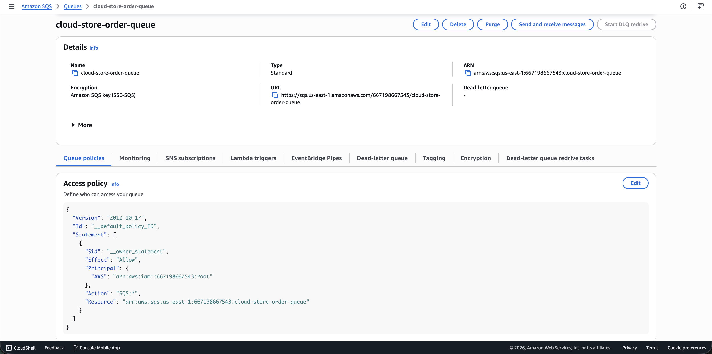

### 2. Provision the SNS Topic & Subscription
1. Open the **Amazon SNS Console** -> **Topics** -> Click **Create topic**.
2. **Details:**
   * Type: `Standard`
   * Name: `cloud-store-order-topic`
3. Click **Create topic** and *note down the `Topic ARN`*.
4. Go to the **Subscriptions** tab -> Click **Create subscription**.
5. **Details:**
   * Topic ARN: Select the topic you just created.
   * Protocol: `Email`
   * Endpoint: `your-email@example.com`
6. Click **Create subscription**.
7. **CRITICAL:** Open your email inbox, find the AWS Notification email, and click **Confirm subscription**.

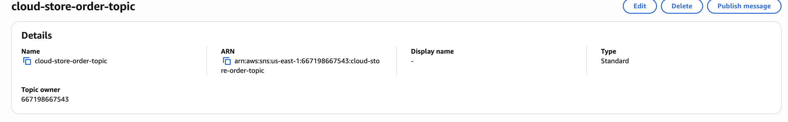

---

## 🔐 Phase 2: Security & IAM Roles
Our Lambdas adhere to the principle of least privilege. We need two distinct roles.

### 1. Producer Lambda Role (`iam_producer_role`)
1. Open the **IAM Console** -> **Roles** -> **Create role**.
2. Trusted entity: `AWS service` -> Use case: `Lambda`.
3. Add the managed policy: `AWSLambdaBasicExecutionRole` (for CloudWatch logs).
4. Create an inline policy allowing SQS access:
    ```json
    {
        "Version": "2012-10-17",
        "Statement": [{
            "Effect": "Allow",
            "Action": "sqs:SendMessage",
            "Resource": "arn:aws:sqs:us-east-1:<ACCOUNT_ID>:cloud-store-order-queue"
        }]
    }
    ```
5. Name the role `checkout_producer_role` and save.

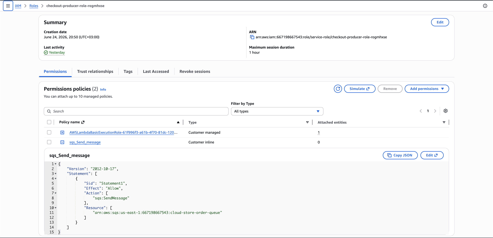

### 2. Consumer Lambda Role (`iam_consumer_role`)
1. Create another Lambda role.
2. Add the following managed policies:
   * `AWSLambdaVPCAccessExecutionRole` (CRITICAL: Allows ENI creation in private subnets).
   * `AWSLambdaBasicExecutionRole`
3. Create an inline policy for SQS, SNS, and Secrets Manager:
    ```json
    {
        "Version": "2012-10-17",
        "Statement": [
            {
                "Effect": "Allow",
                "Action": ["sqs:ReceiveMessage", "sqs:DeleteMessage", "sqs:GetQueueAttributes"],
                "Resource": "arn:aws:sqs:us-east-1:<ACCOUNT_ID>:cloud-store-order-queue"
            },
            {
                "Effect": "Allow",
                "Action": "sns:Publish",
                "Resource": "arn:aws:sns:us-east-1:<ACCOUNT_ID>:cloud-store-order-topic"
            },
            {
                "Effect": "Allow",
                "Action": "secretsmanager:GetSecretValue",
                "Resource": "arn:aws:secretsmanager:us-east-1:<ACCOUNT_ID>:secret:rds_secrets-*"
            }
        ]
    }
    ```
4. Name the role `checkout_consumer_role` and save.

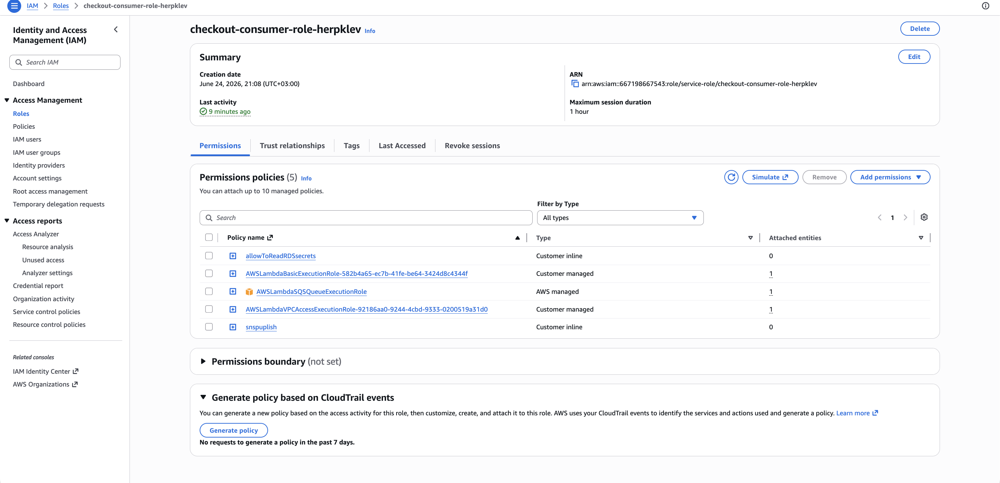

---

## ⚡ Phase 3: The Producer Lambda (API Entry Point)

1. Open the **AWS Lambda Console** -> Click **Create function**.
2. **Basic information:**
   * Function name: `checkout-producer`
   * Runtime: `Python 3.12`
   * Execution role: Select **Use an existing role** -> Choose `checkout_producer_role`.
3. Click **Create function**.
4. Go to the **Configuration** tab -> **Environment variables**:
   * Add `SQS_QUEUE_URL` = `https://sqs.us-east-1.amazonaws.com/...`
   * Add `CORS_ORIGIN` = `https://salamaxx97.online`
5. Paste the Producer Code from  `checkout_producer.py` into `lambda_function.py` :
6. Click **Deploy**.

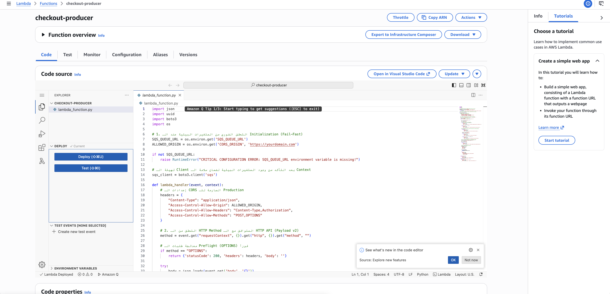
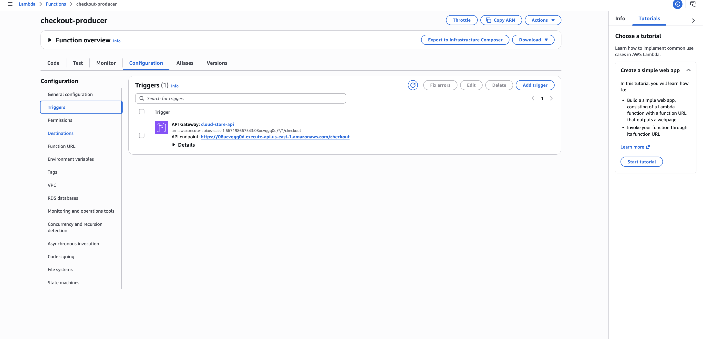
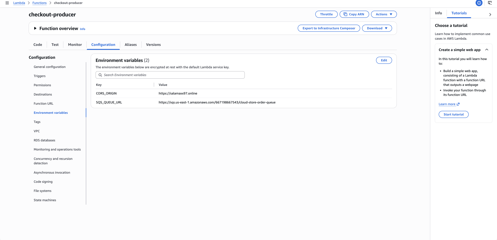

---

## 🛡️ Phase 4: The Consumer Lambda (VPC & Database Layer)

The Consumer Lambda is the core processing worker of the serverless checkout pipeline. Operating entirely decoupled from the public-facing API, its responsibility is to pull transaction batches from Amazon SQS, execute secure data ingestion paths inside an isolated network tier, and broadcast transaction states across event-driven notification systems.

### 1. Function Creation & Basic Configuration
1. Open the **AWS Lambda Console** and click **Create function**.
2. Select **Author from scratch** and set the following parameters:
   * **Function name:** `checkout-consumer`
   * **Runtime:** `Python 3.12`
   * **Architecture:** `x86_64`
3. Under the **Permissions** section:
   * Select **Use an existing role**.
   * Choose **`checkout_consumer_role`** (the execution role provisioned with permissions for SQS polling, Secrets Manager decryption, SNS publishing, and VPC network interface binding).
4. Click **Create function**.

### 2. Dedicated Security Group Creation & RDS Custom Inbound Rule
To implement strict network isolation and follow security best practices, we will create a dedicated Security Group for this Lambda function that permits outbound connections without exposing any inbound access points.
1. Open the **🏢 AWS VPC Console** -> **Security Groups** -> Click **Create security group**.
2. Configure the following settings:
   * **Security group name:** `sg_checkout_consumer`
   * **Description:** Isolated outbound security group for the checkout consumer Lambda.
   * **VPC:** Select `cloud-store-vpc`.
3. **Inbound rules:** Leave this section completely blank (**No inbound rules** required).
4. Click **Create security group**.
5. **Update RDS Access Control:** Navigate immediately to your database security group (**`sg_RDS`**), click **Edit inbound rules**, and append a new authorization row:
   * **Type:** `PostgreSQL` (Port `5432`)
   * **Source:** Custom -> Search and select your newly created **`sg_checkout_consumer`**.
   * Click **Save rules**.

### 3. VPC Network Injection
Now, inject the Lambda execution path directly into your internal data network tier:
1. Go back to your `checkout-consumer` function dashboard in the Lambda Console.
2. Navigate to the **Configuration** tab -> **VPC** and click **Edit**.
3. Select **`cloud-store-vpc`** from the menu.
4. **Subnets:** Select your two **Private App Subnets**. This places the execution workers in the same subnet layers as the RDS cluster.
5. **Security Groups:** Select **only** the custom isolation group you just created: **`sg_checkout_consumer`**.
6. Click **Save** (Allow a few moments for AWS to provision and bind the elastic network interfaces).

### 4. Custom Database Layer Deployment (.ZIP Archive Upload)
The native AWS Lambda Python runtime lacks built-in PostgreSQL database engine drivers (`psycopg2`). To provision this component securely using the deployment-ready assets managed within your repository:
1. From the left sidebar of the **AWS Lambda Console**, navigate to **Layers** -> Click **Create layer**.
2. Configure the layer details:
   * **Name:** `psycopg2-postgres-driver`
   * **Description:** Custom pre-compiled psycopg2 binary package for database connection pooling.
3. Select **Upload a .zip file** and click **Upload**.
4. Browse your local environment and select the **`psycopg2-layer.zip`** package sourced directly from your repository asset directory.
5. **Compatible runtimes:** Check **`Python 3.12`**.
6. Click **Create**.
7. Return to your `checkout-consumer` function dashboard -> Scroll to the very bottom to find the **Layers** sub-panel -> Click **Add a layer** -> Choose **Custom layers** -> Select **`psycopg2-postgres-driver`** from the list, choose version `1`, and click **Add**.

### 5. Environment Variables Configuration
Provide the runtime environment with secure hooks to resolve dynamic infrastructure endpoints:
1. Navigate to the **Configuration** tab -> **Environment variables**.
2. Click **Edit** and map the following configuration keys:
   * **Key:** `DB_SECRET_NAME` | **Value:** `rds_secrets`
   * **Key:** `SNS_TOPIC_ARN` | **Value:** *[Your live Amazon SNS Topic ARN string]*
   * **Key:** `DB_HOST` | **Value:** `<XXXXX.us-east-1.rds.amazonaws.com>`
   * **Key:** `DB_NAME` | **Value:** `ecommerce`

3. Click **Save**.

### 6. Event Source Mapping (SQS Trigger Integration)
To establish the automated polling workflow that feeds messages into your consumer function, you must bind the queue as an upstream event source:
1. In the function's visual topology designer map, click **Add trigger**.
2. Select **SQS** from the trigger configuration dropdown list.
3. **SQS queue:** Search for and select **`cloud-store-order-queue`**.
4. **Batch size:** Set to `10` (Tuning this value balances database transaction sizes with system processing throughput).
5. Leave other concurrency and window limits at their default values and click **Add**.

### 7. Core Execution Logic Deployment (Copy & Paste Code)
1. Navigate back to the main **Code** tab of your function.
2. In the built-in cloud editor pane, open the default entry point file (e.g., `lambda_function.py`).
3. Select all existing boilerplate code, delete it, and **Copy & Paste** the fully developed consumer script directly from your the repository assets `checkout-consumer.py`.
4. Click **Deploy** to finalize the state machine changes and make your background processor live.

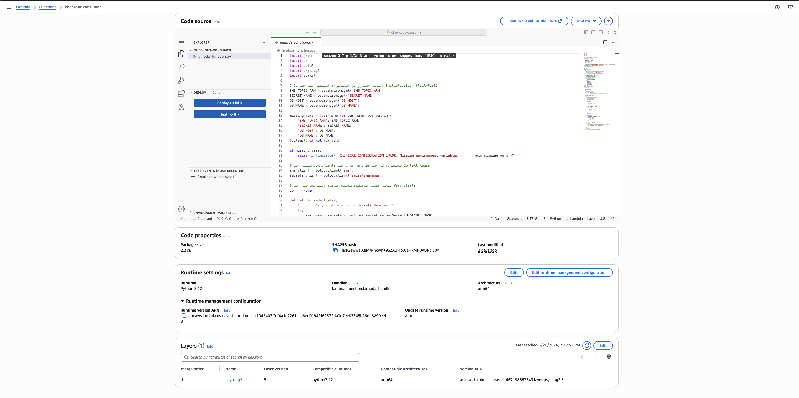
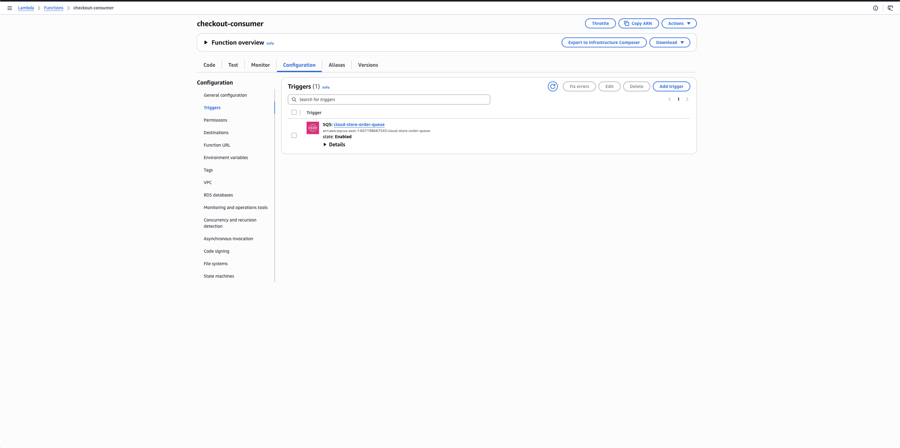
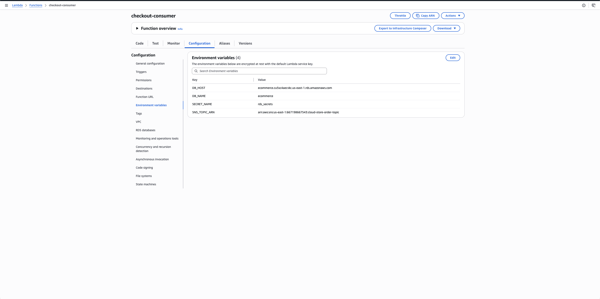
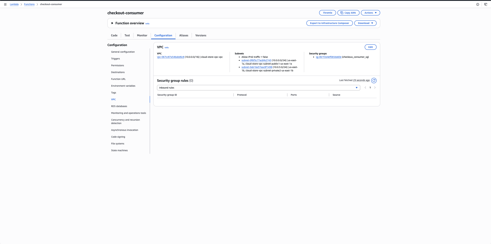
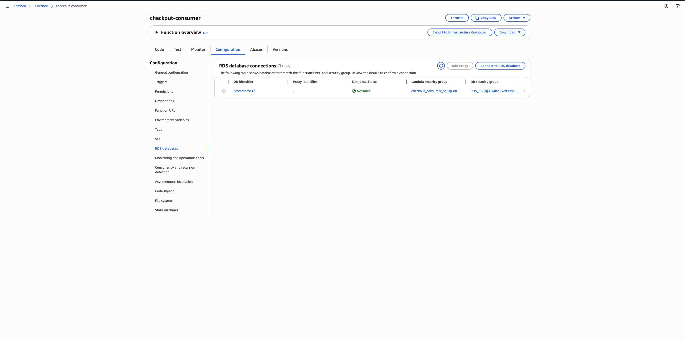


## 🌐 Phase 5: API Gateway & Security Routing

1. Open **API Gateway Console** -> Create **HTTP API** .
2. **API Name:** `cloud-store-api`.
3. **Configure Routes:**
   * Click **Routes** -> Create route: `POST /checkout`.
4. **Configure Integration:**
   * Attach the `POST /checkout` route to the `checkout-producer` Lambda.
5. **Configure Authorization (Cognito):**
   * Go to **Authorization** -> Select the `POST /checkout` route.
   * Create and attach a **JWT Authorizer** linked to your existing Cognito User Pool.
6. **Configure CORS:**
   * Allow Origins: `https://yourdomain.com`
   * Allow Methods: `POST`, `OPTIONS`
   * Allow Headers: `Authorization`, `Content-Type`

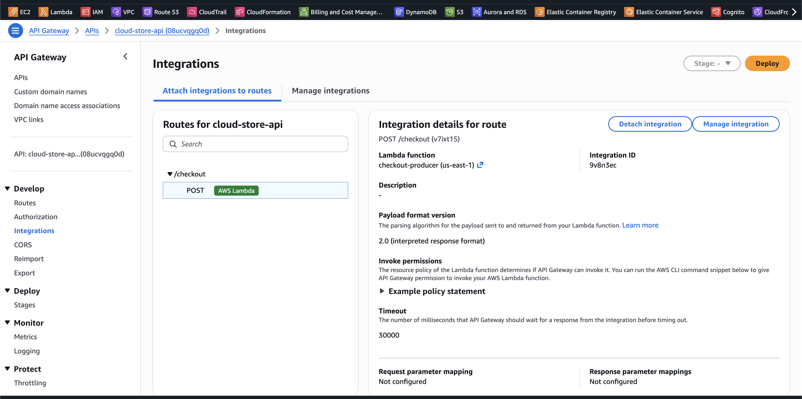
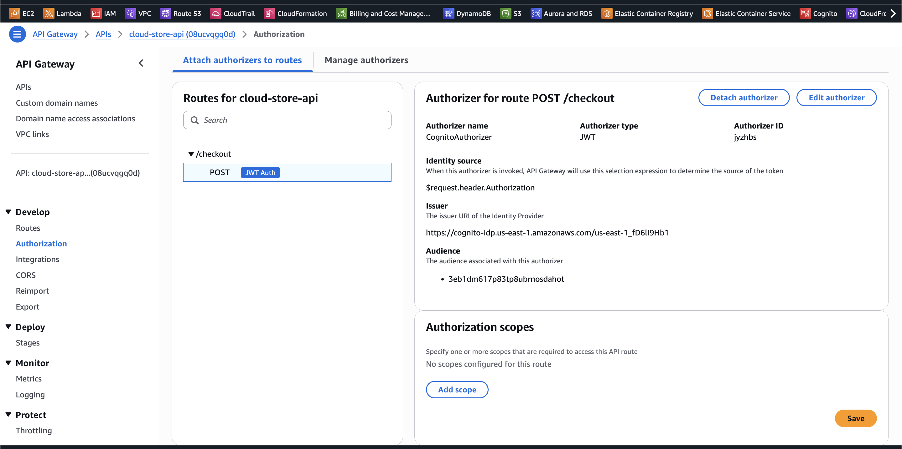
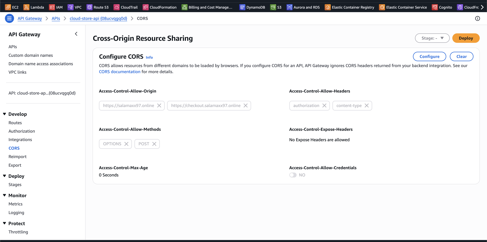


---

## 🌍 Phase 6: Custom Domain & Route 53 Mapping

We will hide the ugly AWS API URL behind our secure production domain.

### 1. ACM Certificate Validation
Ensure you have a validated **Public Certificate** in **AWS Certificate Manager (ACM)** for `*.yourdomain.com` (must be in the same region as the API Gateway).

### 2. API Gateway Custom Domain
1. In API Gateway, navigate to **Custom domain names** -> Click **Create**.
2. **Domain name:** `checkout.yourdomain.com`
3. **Certificate:** Select your ACM certificate -> Click **Create**.
4. Go to the **API mappings** tab -> Click **Configure API mappings**.
5. **Add new mapping:**
   * API: `cloud-store-api`
   * Stage: `$default`
   * Path: *(Leave empty)*
6. Click **Save** and copy the **API Gateway domain name** (e.g., `d-xxxx.execute-api.us-east-1.amazonaws.com`).

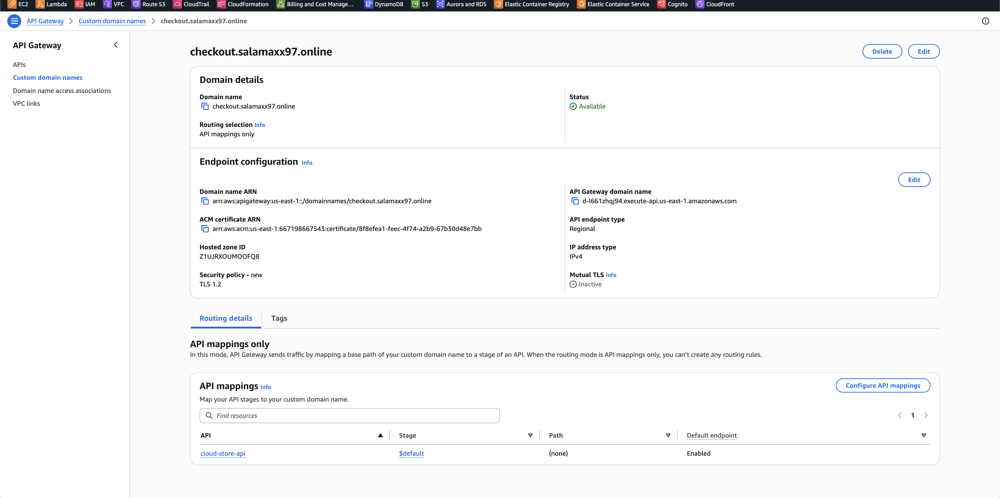


### 3. Route 53 DNS Resolution
1. Open **Route 53** -> **Hosted zones** -> Select your domain.
2. Click **Create record**.
3. **Record name:** `api`
4. **Record type:** `A`
5. **Alias:** Turn **On**.
6. **Route traffic to:** Select **Alias to API Gateway API** -> Select your Region -> Paste/Select the `d-xxxx` domain.
7. Click **Create records**.

---

## 🎯 Phase 7: End-to-End Serverless Pipeline Verification (Browser & UI Demo)

To validate that our asynchronous, event-driven checkout pipeline is fully integrated, operational, and secure, we perform the validation tests directly via the production browser interface, tracking the end-to-end data lifecycle using real-time console tracing and UI indicators.

### 1. Ingress Execution via Web Client UI
1. Open your production browser and navigate to your deployed storefront application: `https://YOURDOMAIN.com`
2. Add target items to your shopping cart, ensure your user session is securely authenticated via **Amazon Cognito**, and click the **Proceed to Checkout / Submit Order** button.
3. The browser application client compiles the payload data and immediately triggers an asynchronous secure API connection to your custom gateway API staging route.

### 2. Network Traffic Inspection (Browser DevTools Check)
1. Open your browser Developer Tools (**F12** or `Ctrl+Shift+I`) and navigate immediately to the **Network** tab before submitting the transaction.
2. Trigger the checkout action and trace the outbound HTTP requests list.
3. Verify that the frontend application fires an HTTP `POST` request directed to your dedicated serverless gateway subdomain: `https://checkout.Yourdomain.com/checkout`
4. **Headers Tracing:** Expand the request configuration details to confirm that the `Authorization: Bearer <JWT_TOKEN>` header is present and populated with the valid encrypted claims array provided by Cognito.
5. **Status Verification:** Ensure that the gateway server response drops an immediate HTTP Status Code **`202 Accepted`** within milliseconds, proving that the Producer Lambda offloaded the request and freed the user interface thread.

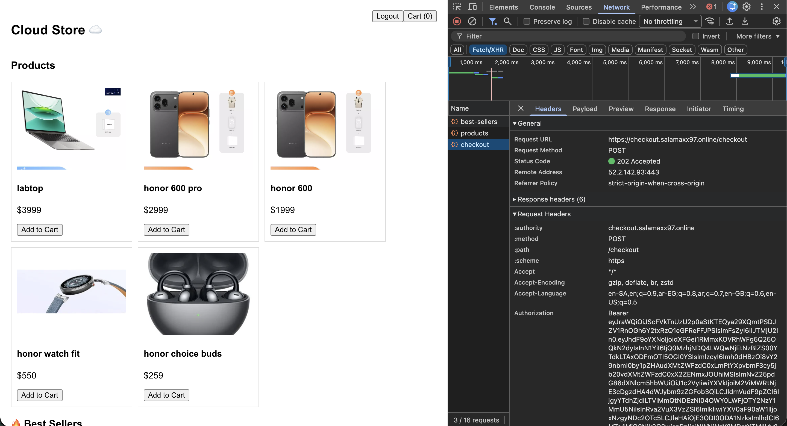

### 3. Messaging Buffer Auditing (Amazon SQS Console Tracing)
1. Keep your storefront browser window open, open another tab, and log into your **AWS Management Console** -> **Amazon SQS**.
2. Select your pipeline buffer queue: **`cloud-store-order-queue`**.
3. Monitor the dynamic operations metrics graphs:
   * Observe the split-second spike in the **Messages Ingested / Received** threshold line.
   * Confirm that the line chart drops straight back down into **Messages Deleted / Cleared**, validating that the background consumer worker immediately drained the queue records automatically.

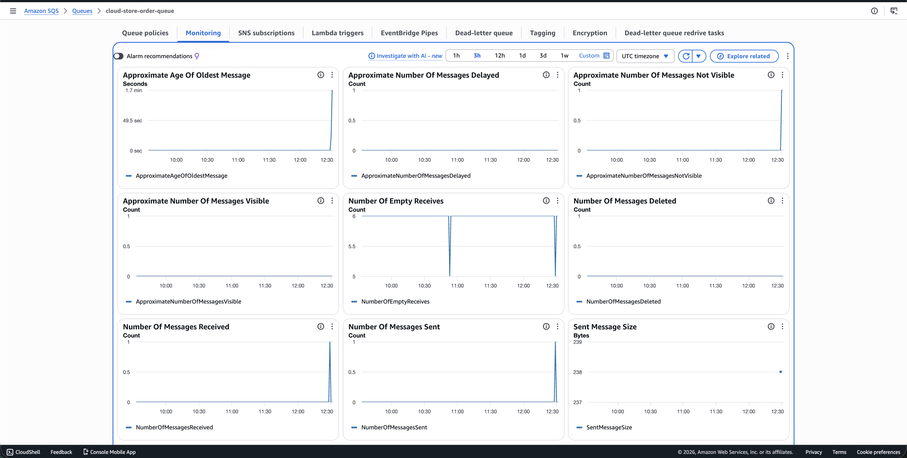

### 5. Asynchronous Event Broadcasting Verification (Email Check)
1. Open another browser tab and log into the external email client account bound during the **Amazon SNS** configuration subscription phase (`your-email@example.com`).
2. Check your incoming mail stack folder layout.
3. Verify that you have successfully received a structured order notification message block outlining the distinct order tracking tokens, timestamp metrics, and success states compiled dynamically by your consumer function worker.

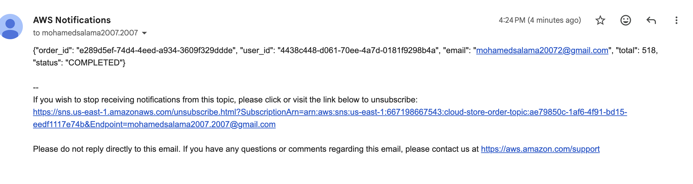

---

# 🚀 Future Improvements

To transition this architecture from a functional prototype into an enterprise-grade, highly secure, and automated production system, the following enhancements are planned for implementation:

### 🏗️ 1. Infrastructure as Code (IaC) & Frontend Modernization
* **Static Website Hosting with Amazon S3:** Migrate the React frontend from local hosting to a private, highly available Amazon S3 bucket, completely disabling public access at the bucket level.
* **Global Content Delivery via Amazon CloudFront:** Deploy a CloudFront CDN distribution in front of the S3 bucket to ensure ultra-low latency global delivery, asset caching, and mandatory HTTPS/TLS 1.2+ encryption.
* **Origin Access Control (OAC) Integration:** Enforce CloudFront OAC to restrict S3 bucket access exclusively to CloudFront traffic, ensuring the static storage remains completely shielded from direct public traversal.
* **Full Automation with HashiCorp Terraform:** Refactor the entire environment (VPC, RDS, SQS, Lambda, SNS, S3, and CloudFront) into modular Terraform manifests (`.tf`) to enable deterministic, single-command environment provisioning.

### 💻 2. Real Application Logic Integration (Decoupling from Dummy Data)
* **Dynamic Database Querying in Lambda:** Replace hardcoded transactional responses with live database lookups. The Lambda consumer will intercept the incoming SQS `product_id`, query the RDS PostgreSQL `products` master table to fetch real human-readable names and pricing, and inject them into the final invoice.
* **Production-Grade React Frontend Engine:** Enhance the UI to feature a persistent state shopping cart, proper state validation, and a dynamic payload construct that securely dispatches real user orders via API Gateway.

### 🔒 3. Enterprise Security Hardening
* **AWS VPC Endpoints (PrivateLink Deployment):** Provision Private Interface Endpoints for *AWS Secrets Manager* and *Amazon SNS* inside the isolated private subnets. This completely eliminates data traversal through the public internet or NAT Gateways, slashing bandwidth costs and shrinking the network attack surface.
* **Strict Security Group Micro-segmentation:** Restrict the RDS PostgreSQL inbound rules to explicitly block all public and private traffic, accepting connections *only* on port 5432 coming strictly from the specific Security Group attached to the Lambda function.
* **Data-at-Rest Encryption (AWS KMS):** Implement Customer Managed Keys (CMKs) via AWS KMS to encrypt SQS queues, SNS topics, S3 assets, and RDS storage volumes natively.

### 🚀 4. Full CI/CD Automation Pipelines (GitHub Actions)
Establish an automated GitOps lifecycle using two isolated workflows inside `.github/workflows/`:
* **Infrastructure Pipeline (`infrastructure-pipeline.yml`):** Automatically triggers on changes to the `terraform/` directory to run linting, security scanning, `terraform plan`, and automated `terraform apply` upon code merging to the `main` branch.
* **Application Deployment Pipeline (`app-pipeline.yml`):** * *Frontend:* Automatically triggers an optimized production build (`npm run build`), syncs the assets to the secure S3 bucket, and forces an automated CloudFront cache invalidation.
  * *Backend:* Automatically resolves dependencies, compiles the Python deployment package, zips the bundle, and updates the AWS Lambda function code seamlessly with zero downtime.

---
# 📄 License

This project is licensed under the **MIT License** - see the below summary for details:

```text
Copyright (c) 2026 Mohamed Salama

Permission is hereby granted, free of charge, to any person obtaining a copy
of this software and associated documentation files (the "Software"), to deal
in the Software without restriction, including without limitation the rights
to use, copy, modify, merge, publish, distribute, sublicense, and/or sell
copies of the Software, and to permit persons to whom the Software is
furnished to do so, subject to the following conditions:

The above copyright notice and this permission notice shall be included in all
copies or substantial portions of the Software.